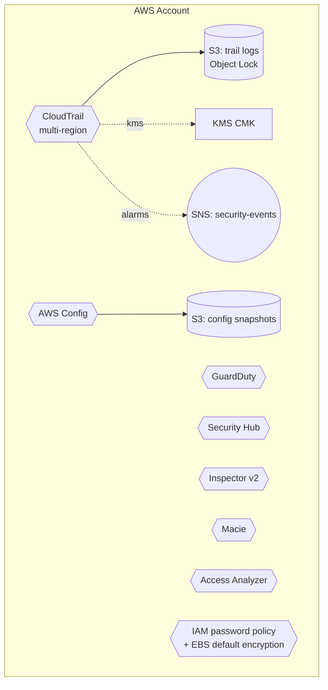

# Pattern: Account Baseline

## When to use
- Establishing the **account-wide** security posture that every workload module in the account depends on.
- First-time setup of a new AWS account before any workload is deployed.
- Bringing an existing account up to ISO 27001 baseline so per-workload audits no longer FAIL on account-scope controls.

## Not when
- You want workload-specific security (WAF on a CloudFront distribution, least-priv IAM for a Lambda, RDS encryption with a workload-owned CMK). Those live in the workload pattern files.
- You want org-level controls (Control Tower, Organizations SCPs, delegated admin). This pattern is single-account; org-level patterns are a separate concern.

## Components
- **CloudTrail** — multi-region trail with log file validation, global service events enabled, KMS-encrypted logs, S3 bucket with Object Lock (GOVERNANCE 90d) and deny-delete policy.
- **GuardDuty** — account detector with S3 logs, Kubernetes audit logs, and malware protection datasources enabled.
- **Security Hub** — account subscription + AWS Foundational Security Best Practices + CIS AWS Foundations Benchmark standards.
- **AWS Config** — configuration recorder (all resources, global + regional) + delivery channel to a Config-dedicated S3 bucket.
- **IAM account password policy** — length ≥14, complexity flags, reuse prevention 5, max age 90 days.
- **EBS encryption by default** — account-level setting so any future EC2/EBS defaults to encrypted.
- **IAM Access Analyzer** — account-level analyzer for external access findings.
- **Inspector v2** — enabler for EC2 + ECR + Lambda scan types.
- **Macie** — account enabler with 15-minute finding publishing frequency.
- **KMS CMK** — one customer-managed key for CloudTrail log encryption (rotation enabled).
- **Security-events SNS topic** — single channel for CloudWatch metric-filter alarms (root login, IAM policy changes, CloudTrail config changes, SG changes, S3 policy changes).

## Parameters (from interview)
| Interview input | Baseline knob |
|---|---|
| `environments` | treated as accounts; emit one `<account>.tfvars` per entry (typically `dev-account`, `staging-account`, `prod-account`) |
| `region` | home region for CloudTrail trail + Config recorder; trail is multi-region so other regions are still captured |
| `traffic` | unused (account baseline is not traffic-sensitive) |
| `data_sensitivity` | `regulated-PII` → adds Macie scheduled classification job; otherwise Macie is on-demand only |
| `auth` | unused |

## Terraform layout
Flat — single root module, no submodules.
```
main.tf, variables.tf, outputs.tf, versions.tf, <account>.tfvars, terraform.tfvars.example
```

## WAF pillar annotations
- **Reliability:** CloudTrail log file validation ON; Object Lock protects the audit trail from tampering. KMS key rotation ON.
- **Performance:** N/A (governance controls, not data-path infra).
- **Cost:** GuardDuty + Security Hub + Config + Macie + Inspector together run ~$30-80/month for a small account. Macie is the biggest variable — scale with bucket count + object volume. Disable `macie_enabled` in dev accounts if budget-sensitive.
- **Ops Excellence:** CloudWatch log group retention on CloudTrail log group; metric filters + alarms for the 5 core security events publish to a single SNS topic. Operators subscribe post-deploy.
- **Sustainability:** Config recording of all resources is write-heavy; the S3 bucket uses Intelligent-Tiering + 365d expiration for Config snapshots to keep storage efficient.
- **Security:** This pattern IS the security baseline. CloudTrail + GuardDuty + Security Hub + Config = account-level SIEM foundation. Defence-in-depth: even if a workload module forgets a control, the account baseline catches it.
- **Privacy:** Audit logs (CloudTrail, Config) may contain IAM principal ARNs and IP addresses — not customer PII, but review in your ROPA as "administrative metadata" processing. Trail + Config bucket residency pinned via `var.region`.

## Variations
- **− Macie:** `macie_enabled = false` disables Macie. Recommended only for dev/sandbox accounts where cost sensitivity outweighs accidental-PII detection.
- **− Inspector:** `inspector_enabled = false` disables Inspector v2. Only appropriate if the account has no EC2/ECR/Lambda (e.g., a billing-only account).
- **+ Org-trail:** if this account is the Organizations management account, set `is_organization_trail = true` on the CloudTrail resource to capture events from every member account into this trail's S3 bucket.

## Mermaid snippet


## Terraform (complete)

### `versions.tf`
```hcl
terraform {
  required_version = ">= 1.7"
  required_providers {
    aws = { source = "hashicorp/aws", version = "~> 5.0" }
  }
}
```

### `variables.tf`
```hcl
variable "workload" {
  type        = string
  description = "Usually the org or account label, e.g. 'acme-prod-account'"
}
variable "environment" {
  type        = string
  description = "Account label, e.g. 'dev-account', 'prod-account'"
}
variable "owner" { type = string }
variable "cost_center" { type = string }
variable "region" { type = string }
variable "log_retention_days" {
  type    = number
  default = 365
}
variable "trail_object_lock_days" {
  type    = number
  default = 90
}
variable "macie_enabled" {
  type    = bool
  default = true
}
variable "inspector_enabled" {
  type    = bool
  default = true
}
variable "is_organization_trail" {
  type        = bool
  default     = false
  description = "Set true only if applying to the Organizations management account"
}
variable "security_alert_email" {
  type        = string
  default     = null
  description = "If set, subscribes this email to the security-events SNS topic"
}
```

### `main.tf`
```hcl
provider "aws" {
  region = var.region
  default_tags {
    tags = {
      Environment = var.environment
      Workload    = var.workload
      Owner       = var.owner
      CostCenter  = var.cost_center
      ManagedBy   = "terraform"
      DataClass   = "audit"
    }
  }
}

data "aws_caller_identity" "current" {}
data "aws_partition" "current" {}

resource "random_id" "suffix" {
  byte_length = 4
}

# ---- KMS CMK for CloudTrail log encryption ----
resource "aws_kms_key" "trail" {
  description             = "CMK for CloudTrail log encryption"
  deletion_window_in_days = 30
  enable_key_rotation     = true
  policy = jsonencode({
    Version = "2012-10-17"
    Statement = [
      {
        Sid       = "EnableRootAccount"
        Effect    = "Allow"
        Principal = { AWS = "arn:${data.aws_partition.current.partition}:iam::${data.aws_caller_identity.current.account_id}:root" }
        Action    = "kms:*"
        Resource  = "*"
      },
      {
        Sid       = "AllowCloudTrailEncrypt"
        Effect    = "Allow"
        Principal = { Service = "cloudtrail.amazonaws.com" }
        Action    = ["kms:GenerateDataKey*", "kms:DescribeKey"]
        Resource  = "*"
      }
    ]
  })
}

resource "aws_kms_alias" "trail" {
  name          = "alias/${var.workload}-${var.environment}-trail"
  target_key_id = aws_kms_key.trail.key_id
}

# ---- CloudTrail log bucket with Object Lock ----
resource "aws_s3_bucket" "trail" {
  bucket              = "${var.workload}-${var.environment}-trail-${random_id.suffix.hex}"
  object_lock_enabled = true
}

resource "aws_s3_bucket_server_side_encryption_configuration" "trail" {
  bucket = aws_s3_bucket.trail.id
  rule {
    apply_server_side_encryption_by_default {
      sse_algorithm     = "aws:kms"
      kms_master_key_id = aws_kms_key.trail.arn
    }
  }
}

resource "aws_s3_bucket_public_access_block" "trail" {
  bucket                  = aws_s3_bucket.trail.id
  block_public_acls       = true
  block_public_policy     = true
  ignore_public_acls      = true
  restrict_public_buckets = true
}

resource "aws_s3_bucket_object_lock_configuration" "trail" {
  bucket = aws_s3_bucket.trail.id
  rule {
    default_retention {
      mode = "GOVERNANCE"
      days = var.trail_object_lock_days
    }
  }
}

resource "aws_s3_bucket_policy" "trail" {
  bucket = aws_s3_bucket.trail.id
  policy = jsonencode({
    Version = "2012-10-17"
    Statement = [
      {
        Sid       = "AWSCloudTrailAclCheck"
        Effect    = "Allow"
        Principal = { Service = "cloudtrail.amazonaws.com" }
        Action    = "s3:GetBucketAcl"
        Resource  = aws_s3_bucket.trail.arn
      },
      {
        Sid       = "AWSCloudTrailWrite"
        Effect    = "Allow"
        Principal = { Service = "cloudtrail.amazonaws.com" }
        Action    = "s3:PutObject"
        Resource  = "${aws_s3_bucket.trail.arn}/AWSLogs/${data.aws_caller_identity.current.account_id}/*"
        Condition = {
          StringEquals = { "s3:x-amz-acl" = "bucket-owner-full-control" }
        }
      },
      {
        Sid       = "DenyInsecureTransport"
        Effect    = "Deny"
        Principal = "*"
        Action    = "s3:*"
        Resource  = [aws_s3_bucket.trail.arn, "${aws_s3_bucket.trail.arn}/*"]
        Condition = {
          Bool = { "aws:SecureTransport" = "false" }
        }
      }
    ]
  })
}

# ---- CloudWatch log group for CloudTrail (for metric filters) ----
resource "aws_cloudwatch_log_group" "trail" {
  name              = "/aws/cloudtrail/${var.workload}-${var.environment}"
  retention_in_days = var.log_retention_days
  kms_key_id        = aws_kms_key.trail.arn
}

resource "aws_iam_role" "trail_cloudwatch" {
  name = "${var.workload}-${var.environment}-trail-cw"
  assume_role_policy = jsonencode({
    Version = "2012-10-17"
    Statement = [{
      Effect    = "Allow"
      Principal = { Service = "cloudtrail.amazonaws.com" }
      Action    = "sts:AssumeRole"
    }]
  })
}

resource "aws_iam_role_policy" "trail_cloudwatch" {
  role = aws_iam_role.trail_cloudwatch.id
  policy = jsonencode({
    Version = "2012-10-17"
    Statement = [{
      Effect   = "Allow"
      Action   = ["logs:CreateLogStream", "logs:PutLogEvents"]
      Resource = "${aws_cloudwatch_log_group.trail.arn}:*"
    }]
  })
}

resource "aws_cloudtrail" "main" {
  name                          = "${var.workload}-${var.environment}-trail"
  s3_bucket_name                = aws_s3_bucket.trail.id
  is_multi_region_trail         = true
  is_organization_trail         = var.is_organization_trail
  include_global_service_events = true
  enable_log_file_validation    = true
  kms_key_id                    = aws_kms_key.trail.arn
  cloud_watch_logs_group_arn    = "${aws_cloudwatch_log_group.trail.arn}:*"
  cloud_watch_logs_role_arn     = aws_iam_role.trail_cloudwatch.arn

  event_selector {
    read_write_type           = "All"
    include_management_events = true
  }

  depends_on = [aws_s3_bucket_policy.trail]
}

# ---- GuardDuty ----
resource "aws_guardduty_detector" "main" {
  enable = true
  datasources {
    s3_logs {
      enable = true
    }
    kubernetes {
      audit_logs {
        enable = true
      }
    }
    malware_protection {
      scan_ec2_instance_with_findings {
        ebs_volumes {
          enable = true
        }
      }
    }
  }
}

# ---- Security Hub ----
resource "aws_securityhub_account" "main" {}

data "aws_region" "current" {}

resource "aws_securityhub_standards_subscription" "aws_foundational" {
  depends_on    = [aws_securityhub_account.main]
  standards_arn = "arn:${data.aws_partition.current.partition}:securityhub:${data.aws_region.current.name}::standards/aws-foundational-security-best-practices/v/1.0.0"
}

resource "aws_securityhub_standards_subscription" "cis" {
  depends_on    = [aws_securityhub_account.main]
  standards_arn = "arn:${data.aws_partition.current.partition}:securityhub:::ruleset/cis-aws-foundations-benchmark/v/1.2.0"
}

# ---- AWS Config ----
resource "aws_s3_bucket" "config" {
  bucket = "${var.workload}-${var.environment}-config-${random_id.suffix.hex}"
}

resource "aws_s3_bucket_server_side_encryption_configuration" "config" {
  bucket = aws_s3_bucket.config.id
  rule {
    apply_server_side_encryption_by_default {
      sse_algorithm = "AES256"
    }
  }
}

resource "aws_s3_bucket_public_access_block" "config" {
  bucket                  = aws_s3_bucket.config.id
  block_public_acls       = true
  block_public_policy     = true
  ignore_public_acls      = true
  restrict_public_buckets = true
}

resource "aws_s3_bucket_lifecycle_configuration" "config" {
  bucket = aws_s3_bucket.config.id
  rule {
    id     = "tier-and-expire"
    status = "Enabled"
    transition {
      days          = 30
      storage_class = "INTELLIGENT_TIERING"
    }
    expiration {
      days = 365
    }
  }
}

resource "aws_s3_bucket_policy" "config" {
  bucket = aws_s3_bucket.config.id
  policy = jsonencode({
    Version = "2012-10-17"
    Statement = [
      {
        Sid       = "AWSConfigBucketPermissionsCheck"
        Effect    = "Allow"
        Principal = { Service = "config.amazonaws.com" }
        Action    = "s3:GetBucketAcl"
        Resource  = aws_s3_bucket.config.arn
      },
      {
        Sid       = "AWSConfigBucketDelivery"
        Effect    = "Allow"
        Principal = { Service = "config.amazonaws.com" }
        Action    = "s3:PutObject"
        Resource  = "${aws_s3_bucket.config.arn}/AWSLogs/${data.aws_caller_identity.current.account_id}/Config/*"
        Condition = {
          StringEquals = { "s3:x-amz-acl" = "bucket-owner-full-control" }
        }
      }
    ]
  })
}

resource "aws_iam_role" "config" {
  name = "${var.workload}-${var.environment}-config"
  assume_role_policy = jsonencode({
    Version = "2012-10-17"
    Statement = [{
      Effect    = "Allow"
      Principal = { Service = "config.amazonaws.com" }
      Action    = "sts:AssumeRole"
    }]
  })
}

resource "aws_iam_role_policy_attachment" "config" {
  role       = aws_iam_role.config.name
  policy_arn = "arn:${data.aws_partition.current.partition}:iam::aws:policy/service-role/AWS_ConfigRole"
}

resource "aws_config_configuration_recorder" "main" {
  name     = "${var.workload}-${var.environment}-recorder"
  role_arn = aws_iam_role.config.arn
  recording_group {
    all_supported                 = true
    include_global_resource_types = true
  }
}

resource "aws_config_delivery_channel" "main" {
  name           = "${var.workload}-${var.environment}-channel"
  s3_bucket_name = aws_s3_bucket.config.id
  depends_on     = [aws_config_configuration_recorder.main, aws_s3_bucket_policy.config]
}

resource "aws_config_configuration_recorder_status" "main" {
  name       = aws_config_configuration_recorder.main.name
  is_enabled = true
  depends_on = [aws_config_delivery_channel.main]
}

# ---- IAM account password policy ----
resource "aws_iam_account_password_policy" "strict" {
  minimum_password_length        = 14
  require_uppercase_characters   = true
  require_lowercase_characters   = true
  require_numbers                = true
  require_symbols                = true
  allow_users_to_change_password = true
  password_reuse_prevention      = 5
  max_password_age               = 90
}

# ---- EBS encryption by default ----
resource "aws_ebs_encryption_by_default" "main" {
  enabled = true
}

# ---- IAM Access Analyzer ----
resource "aws_accessanalyzer_analyzer" "account" {
  analyzer_name = "${var.workload}-${var.environment}-account"
  type          = "ACCOUNT"
}

# ---- Inspector v2 ----
resource "aws_inspector2_enabler" "main" {
  count          = var.inspector_enabled ? 1 : 0
  account_ids    = [data.aws_caller_identity.current.account_id]
  resource_types = ["EC2", "ECR", "LAMBDA"]
}

# ---- Macie ----
resource "aws_macie2_account" "main" {
  count                        = var.macie_enabled ? 1 : 0
  finding_publishing_frequency = "FIFTEEN_MINUTES"
  status                       = "ENABLED"
}

# ---- Security-events SNS topic + optional email subscription ----
resource "aws_sns_topic" "security_events" {
  name              = "${var.workload}-${var.environment}-security-events"
  kms_master_key_id = "alias/aws/sns"
}

resource "aws_sns_topic_subscription" "security_email" {
  count     = var.security_alert_email == null ? 0 : 1
  topic_arn = aws_sns_topic.security_events.arn
  protocol  = "email"
  endpoint  = var.security_alert_email
}

# ---- CloudWatch metric filters + alarms for 5 core security events ----
locals {
  security_alarms = {
    root_login = {
      pattern = "{ $.userIdentity.type = \"Root\" && $.eventType != \"AwsServiceEvent\" }"
      metric  = "RootAccountLoginCount"
    }
    iam_policy_changes = {
      pattern = "{ ($.eventName=DeleteGroupPolicy) || ($.eventName=DeleteRolePolicy) || ($.eventName=DeleteUserPolicy) || ($.eventName=PutGroupPolicy) || ($.eventName=PutRolePolicy) || ($.eventName=PutUserPolicy) || ($.eventName=CreatePolicy) || ($.eventName=DeletePolicy) || ($.eventName=CreatePolicyVersion) || ($.eventName=DeletePolicyVersion) || ($.eventName=AttachRolePolicy) || ($.eventName=DetachRolePolicy) || ($.eventName=AttachUserPolicy) || ($.eventName=DetachUserPolicy) || ($.eventName=AttachGroupPolicy) || ($.eventName=DetachGroupPolicy) }"
      metric  = "IamPolicyChanges"
    }
    cloudtrail_changes = {
      pattern = "{ ($.eventName=CreateTrail) || ($.eventName=UpdateTrail) || ($.eventName=DeleteTrail) || ($.eventName=StartLogging) || ($.eventName=StopLogging) }"
      metric  = "CloudTrailChanges"
    }
    sg_changes = {
      pattern = "{ ($.eventName=AuthorizeSecurityGroupIngress) || ($.eventName=AuthorizeSecurityGroupEgress) || ($.eventName=RevokeSecurityGroupIngress) || ($.eventName=RevokeSecurityGroupEgress) || ($.eventName=CreateSecurityGroup) || ($.eventName=DeleteSecurityGroup) }"
      metric  = "SecurityGroupChanges"
    }
    s3_policy_changes = {
      pattern = "{ ($.eventSource=s3.amazonaws.com) && (($.eventName=PutBucketAcl) || ($.eventName=PutBucketPolicy) || ($.eventName=PutBucketCors) || ($.eventName=PutBucketLifecycle) || ($.eventName=PutBucketReplication) || ($.eventName=DeleteBucketPolicy) || ($.eventName=DeleteBucketCors) || ($.eventName=DeleteBucketLifecycle) || ($.eventName=DeleteBucketReplication)) }"
      metric  = "S3BucketPolicyChanges"
    }
  }
}

resource "aws_cloudwatch_log_metric_filter" "security" {
  for_each       = local.security_alarms
  name           = each.key
  pattern        = each.value.pattern
  log_group_name = aws_cloudwatch_log_group.trail.name
  metric_transformation {
    name      = each.value.metric
    namespace = "SecurityMetrics"
    value     = "1"
  }
}

resource "aws_cloudwatch_metric_alarm" "security" {
  for_each            = local.security_alarms
  alarm_name          = "${var.workload}-${var.environment}-${each.key}"
  comparison_operator = "GreaterThanOrEqualToThreshold"
  evaluation_periods  = 1
  metric_name         = each.value.metric
  namespace           = "SecurityMetrics"
  period              = 60
  statistic           = "Sum"
  threshold           = 1
  alarm_actions       = [aws_sns_topic.security_events.arn]
  treat_missing_data  = "notBreaching"
}
```

### `outputs.tf`
```hcl
output "trail_arn" {
  value = aws_cloudtrail.main.arn
}
output "trail_bucket" {
  value = aws_s3_bucket.trail.id
}
output "config_bucket" {
  value = aws_s3_bucket.config.id
}
output "kms_key_arn" {
  value = aws_kms_key.trail.arn
}
output "security_events_topic_arn" {
  value = aws_sns_topic.security_events.arn
}
output "guardduty_detector_id" {
  value = aws_guardduty_detector.main.id
}
```

### `terraform.tfvars.example`
```hcl
workload               = "acme"
environment            = "prod-account"
owner                  = "security-team"
cost_center            = "security"
region                 = "ap-southeast-1"
log_retention_days     = 365
trail_object_lock_days = 90
macie_enabled          = true
inspector_enabled      = true
is_organization_trail  = false # set true only on Organizations management account
security_alert_email   = "security-alerts@example.com"
```
