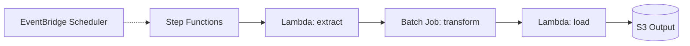

# Pattern: Batch Processing

## When to use
- Long-running computations (> 15 min Lambda limit)
- Nightly ETL jobs, report generation, ML inference batch jobs
- Multi-step workflows with branching / error handling

## Not when
- Sub-minute latency required → `event-driven-async` or `stream-processing`
- Single-step, short-running task → `scheduled-jobs`
- Continuous processing → `stream-processing`

## Components
- Step Functions state machine (orchestration)
- AWS Batch compute environment + job queue + job definition (for CPU-heavy jobs)
- Alternative: Lambda task (for jobs <15 min)
- S3 input / output buckets
- EventBridge Scheduler rule (trigger)

## Parameters
| Interview input | Knob |
|---|---|
| `environments` | per-env state machine and Batch env |
| `region` | region-local |
| `traffic` | Batch min/max vCPU; Lambda memory |
| `data_sensitivity` | CMK on S3, Step Functions logs |
| `auth` | n/a |

## Terraform layout
Flat.

## WAF pillar annotations
- **Reliability:** Step Functions retry + catch blocks on every task; Batch job retry = 2.
- **Performance:** Fargate compute env (Graviton) by default; EC2 compute env only when GPU or CPU-intensive.
- **Cost:** Spot on Batch compute env for non-prod; Fargate Spot for flexible workloads; Min vCPU = 0 so no idle cost.
- **Ops Excellence:** Step Functions execution history 90d; alarms on state machine failures + Batch job failures.
- **Sustainability:** Graviton; Min vCPU = 0; Spot preference for non-critical batches.
- **Security:** Job role scoped to input/output buckets only; KMS CMK when PII+.
- **Privacy:** S3 buckets region-local; output retention configurable.

## Variations
- **+ EMR Serverless:** out of v1
- **+ SageMaker training job:** out of v1
- **Lambda-only pipeline:** when all steps <15 min, skip Batch

## Scope boundary
This pattern scopes to a single workload. The following controls are **account-scope** and handled by the `account-baseline` pattern (apply that first):
- CloudTrail (A.8.15) · GuardDuty (A.8.7) · Security Hub + standards (A.8.16) · AWS Config · IAM account password policy (A.8.5) · EBS encryption by default (A.8.24 account-level) · Access Analyzer · Inspector v2 · Macie.

Audit FAILs on these clauses against a workload module are expected — they're not gaps in this pattern.

## Mermaid snippet


## Terraform (complete)

### `versions.tf`
```hcl
terraform {
  required_version = ">= 1.7"
  required_providers { aws = { source = "hashicorp/aws", version = "~> 5.0" } }
}
```

### `variables.tf`
```hcl
variable "workload" { type = string }
variable "environment" { type = string }
variable "owner" { type = string }
variable "cost_center" { type = string }
variable "repository" { type = string }
variable "region" { type = string }
variable "data_sensitivity" { type = string }
variable "vpc_id" { type = string }
variable "private_subnet_ids" { type = list(string) }
variable "batch_max_vcpus" {
  type    = number
  default = 16
}
variable "schedule_expression" {
  type    = string
  default = "cron(0 2 * * ? *)"
}
variable "job_container_image" { type = string }
```

### `main.tf`
```hcl
provider "aws" {
  region = var.region
  default_tags {
    tags = {
      Environment = var.environment
      Workload    = var.workload
      Owner       = var.owner
      CostCenter  = var.cost_center
      ManagedBy   = "terraform"
      Repository  = var.repository
    }
  }
}

locals {
  use_cmk = contains(["PII", "regulated-PII"], var.data_sensitivity)
}

resource "aws_kms_key" "batch" {
  count                   = local.use_cmk ? 1 : 0
  description             = "${var.workload}-${var.environment} batch CMK"
  deletion_window_in_days = 30
  enable_key_rotation     = true
}

resource "aws_s3_bucket" "io" {
  for_each = toset(["input", "output"])
  bucket   = "${var.workload}-${var.environment}-${each.key}"
}

resource "aws_s3_bucket_public_access_block" "io" {
  for_each                = toset(["input", "output"])
  bucket                  = aws_s3_bucket.io[each.key].id
  block_public_acls       = true
  block_public_policy     = true
  ignore_public_acls      = true
  restrict_public_buckets = true
}

resource "aws_s3_bucket_server_side_encryption_configuration" "io" {
  for_each = toset(["input", "output"])
  bucket   = aws_s3_bucket.io[each.key].id
  rule {
    apply_server_side_encryption_by_default {
      sse_algorithm     = local.use_cmk ? "aws:kms" : "AES256"
      kms_master_key_id = local.use_cmk ? aws_kms_key.batch[0].arn : null
    }
  }
}

resource "aws_security_group" "batch" {
  name   = "${var.workload}-${var.environment}-batch"
  vpc_id = var.vpc_id
  egress {
    from_port   = 0
    to_port     = 0
    protocol    = "-1"
    cidr_blocks = ["0.0.0.0/0"]
  }
}

resource "aws_iam_role" "batch_service" {
  name = "${var.workload}-${var.environment}-batch-service"
  assume_role_policy = jsonencode({
    Version   = "2012-10-17"
    Statement = [{ Action = "sts:AssumeRole", Effect = "Allow", Principal = { Service = "batch.amazonaws.com" } }]
  })
}

resource "aws_iam_role_policy_attachment" "batch_service" {
  role       = aws_iam_role.batch_service.name
  policy_arn = "arn:aws:iam::aws:policy/service-role/AWSBatchServiceRole"
}

resource "aws_batch_compute_environment" "this" {
  name_prefix  = "${var.workload}-${var.environment}-"
  type         = "MANAGED"
  service_role = aws_iam_role.batch_service.arn
  compute_resources {
    type               = "FARGATE"
    max_vcpus          = var.batch_max_vcpus
    subnets            = var.private_subnet_ids
    security_group_ids = [aws_security_group.batch.id]
  }
  lifecycle { create_before_destroy = true }
}

resource "aws_batch_job_queue" "this" {
  name     = "${var.workload}-${var.environment}"
  state    = "ENABLED"
  priority = 1
  compute_environment_order {
    order               = 1
    compute_environment = aws_batch_compute_environment.this.arn
  }
}

resource "aws_iam_role" "job" {
  name = "${var.workload}-${var.environment}-job"
  assume_role_policy = jsonencode({
    Version   = "2012-10-17"
    Statement = [{ Action = "sts:AssumeRole", Effect = "Allow", Principal = { Service = "ecs-tasks.amazonaws.com" } }]
  })
}

resource "aws_iam_role_policy" "job" {
  role = aws_iam_role.job.id
  policy = jsonencode({
    Version = "2012-10-17"
    Statement = [
      { Effect = "Allow", Action = ["s3:GetObject", "s3:ListBucket"], Resource = [aws_s3_bucket.io["input"].arn, "${aws_s3_bucket.io["input"].arn}/*"] },
      { Effect = "Allow", Action = ["s3:PutObject", "s3:ListBucket"], Resource = [aws_s3_bucket.io["output"].arn, "${aws_s3_bucket.io["output"].arn}/*"] },
      { Effect = "Allow", Action = ["logs:CreateLogStream", "logs:PutLogEvents"], Resource = "*" }
    ]
  })
}

resource "aws_iam_role" "job_execution" {
  name = "${var.workload}-${var.environment}-job-exec"
  assume_role_policy = jsonencode({
    Version   = "2012-10-17"
    Statement = [{ Action = "sts:AssumeRole", Effect = "Allow", Principal = { Service = "ecs-tasks.amazonaws.com" } }]
  })
}

resource "aws_iam_role_policy_attachment" "job_execution" {
  role       = aws_iam_role.job_execution.name
  policy_arn = "arn:aws:iam::aws:policy/service-role/AmazonECSTaskExecutionRolePolicy"
}

resource "aws_batch_job_definition" "transform" {
  name                  = "${var.workload}-${var.environment}-transform"
  type                  = "container"
  platform_capabilities = ["FARGATE"]
  retry_strategy { attempts = 2 }
  container_properties = jsonencode({
    image                        = var.job_container_image
    jobRoleArn                   = aws_iam_role.job.arn
    executionRoleArn             = aws_iam_role.job_execution.arn
    fargatePlatformConfiguration = { platformVersion = "LATEST" }
    runtimePlatform = {
      cpuArchitecture       = "ARM64"
      operatingSystemFamily = "LINUX"
    }
    resourceRequirements = [
      { type = "VCPU", value = "1" },
      { type = "MEMORY", value = "2048" }
    ]
    networkConfiguration = { assignPublicIp = "DISABLED" }
    logConfiguration     = { logDriver = "awslogs" }
    environment = [
      { name = "INPUT_BUCKET", value = aws_s3_bucket.io["input"].bucket },
      { name = "OUTPUT_BUCKET", value = aws_s3_bucket.io["output"].bucket }
    ]
  })
}

resource "aws_iam_role" "sfn" {
  name = "${var.workload}-${var.environment}-sfn"
  assume_role_policy = jsonencode({
    Version   = "2012-10-17"
    Statement = [{ Action = "sts:AssumeRole", Effect = "Allow", Principal = { Service = "states.amazonaws.com" } }]
  })
}

resource "aws_iam_role_policy" "sfn" {
  role = aws_iam_role.sfn.id
  policy = jsonencode({
    Version = "2012-10-17"
    Statement = [{
      Effect   = "Allow"
      Action   = ["batch:SubmitJob", "batch:DescribeJobs", "batch:TerminateJob", "events:PutTargets", "events:PutRule", "events:DescribeRule"]
      Resource = "*"
    }]
  })
}

resource "aws_cloudwatch_log_group" "sfn" {
  name              = "/aws/stepfunctions/${var.workload}-${var.environment}"
  retention_in_days = var.environment == "prod" ? 365 : 30
}

resource "aws_sfn_state_machine" "this" {
  name     = "${var.workload}-${var.environment}"
  role_arn = aws_iam_role.sfn.arn
  definition = jsonencode({
    Comment = "${var.workload} batch pipeline"
    StartAt = "Transform"
    States = {
      Transform = {
        Type     = "Task"
        Resource = "arn:aws:states:::batch:submitJob.sync"
        Parameters = {
          JobName       = "${var.workload}-transform"
          JobDefinition = aws_batch_job_definition.transform.arn
          JobQueue      = aws_batch_job_queue.this.arn
        }
        Retry = [{ ErrorEquals = ["States.ALL"], IntervalSeconds = 60, MaxAttempts = 2, BackoffRate = 2.0 }]
        End   = true
      }
    }
  })
  logging_configuration {
    log_destination        = "${aws_cloudwatch_log_group.sfn.arn}:*"
    include_execution_data = false # avoid logging PII
    level                  = "ERROR"
  }
}

resource "aws_scheduler_schedule" "nightly" {
  name                         = "${var.workload}-${var.environment}-nightly"
  schedule_expression          = var.schedule_expression
  schedule_expression_timezone = "UTC"
  flexible_time_window { mode = "OFF" }
  target {
    arn      = aws_sfn_state_machine.this.arn
    role_arn = aws_iam_role.scheduler.arn
  }
}

resource "aws_iam_role" "scheduler" {
  name = "${var.workload}-${var.environment}-scheduler"
  assume_role_policy = jsonencode({
    Version   = "2012-10-17"
    Statement = [{ Action = "sts:AssumeRole", Effect = "Allow", Principal = { Service = "scheduler.amazonaws.com" } }]
  })
}

resource "aws_iam_role_policy" "scheduler" {
  role = aws_iam_role.scheduler.id
  policy = jsonencode({
    Version   = "2012-10-17"
    Statement = [{ Effect = "Allow", Action = "states:StartExecution", Resource = aws_sfn_state_machine.this.arn }]
  })
}
```

### `outputs.tf`
```hcl
output "state_machine_arn" { value = aws_sfn_state_machine.this.arn }
output "input_bucket" { value = aws_s3_bucket.io["input"].bucket }
output "output_bucket" { value = aws_s3_bucket.io["output"].bucket }
```

### `terraform.tfvars.example`
```hcl
workload            = "acme-etl"
environment         = "prod"
owner               = "data-team"
cost_center         = "2345"
repository          = "github.com/acme/etl"
region              = "ap-southeast-1"
data_sensitivity    = "internal"
vpc_id              = "vpc-0abcdef1234567890"
private_subnet_ids  = ["subnet-0aaa", "subnet-0bbb"]
batch_max_vcpus     = 16
schedule_expression = "cron(0 2 * * ? *)"
job_container_image = "123456789012.dkr.ecr.ap-southeast-1.amazonaws.com/acme-etl:latest"
```
