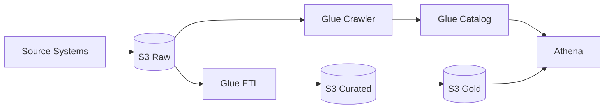

# Pattern: Data Lake

## When to use
- Centralized analytics store for multiple data sources
- Ad-hoc querying over structured + semi-structured data (Parquet, JSON, CSV)
- Data science / BI workloads that don't need sub-second latency

## Not when
- OLTP workload with row-level updates → `three-tier-containerized` with RDS
- Sub-second query latency across large tables → Redshift (out of v1 scope)
- Real-time streaming analytics → `stream-processing`

## Components
- S3 buckets: `raw/`, `curated/`, `gold/` (medallion layout) — one bucket per layer
- AWS Glue Data Catalog (databases: `<workload>_raw`, `<workload>_curated`, `<workload>_gold`)
- AWS Glue crawlers (optional, schedule-driven)
- Athena workgroup (query results bucket)
- Lake Formation (ON when `data_sensitivity ≥ PII` — fine-grained access control)
- KMS CMK for PII+ buckets

## Parameters
| Interview input | Knob |
|---|---|
| `environments` | separate bucket prefix per env |
| `region` | region-local |
| `traffic` | Athena workgroup `bytes_scanned_cutoff_per_query` scales with tier |
| `data_sensitivity` | Lake Formation ON when ≥PII; CMK on all buckets; Glue catalog encryption ON |
| `auth` | n/a — IAM-based access |

## Terraform layout
Flat.

## WAF pillar annotations
- **Reliability:** S3 11×9s durability; catalog + buckets in single region v1; cross-region replication documented as manual future work.
- **Performance:** Parquet + partitioning conventions documented in README; Athena workgroup `engine_version = "Athena engine version 3"`.
- **Cost:** S3 lifecycle (raw → IA at 30d → GLACIER at 180d); Athena bytes-scanned cutoff enforced; Glue crawlers scheduled, not continuous.
- **Ops Excellence:** CloudWatch alarm on Athena query failure rate; Glue job run history retained.
- **Sustainability:** Lifecycle-driven tiering; Glue Graviton jobs (G.1X ARM64 when available).
- **Security:** Buckets blocked public; IAM boundary prevents data egress.
- **Privacy:** Lake Formation for ≥PII; bucket location = user region; CMK SSE.

## Variations
- **+ EMR / Spark:** out of v1
- **+ QuickSight:** document as post-deploy manual step
- **+ Redshift Spectrum:** out of v1

## Scope boundary
This pattern scopes to a single workload. The following controls are **account-scope** and handled by the `account-baseline` pattern (apply that first):
- CloudTrail (A.8.15) · GuardDuty (A.8.7) · Security Hub + standards (A.8.16) · AWS Config · IAM account password policy (A.8.5) · EBS encryption by default (A.8.24 account-level) · Access Analyzer · Inspector v2 · Macie.

Audit FAILs on these clauses against a workload module are expected — they're not gaps in this pattern.

## Mermaid snippet


## Terraform (complete)

### `versions.tf`
```hcl
terraform {
  required_version = ">= 1.7"
  required_providers { aws = { source = "hashicorp/aws", version = "~> 5.0" } }
}
```

### `variables.tf`
```hcl
variable "workload" { type = string }
variable "environment" { type = string }
variable "owner" { type = string }
variable "cost_center" { type = string }
variable "repository" { type = string }
variable "region" { type = string }
variable "data_sensitivity" { type = string }
variable "athena_bytes_scanned_cutoff" {
  type    = number
  default = 10737418240 # 10 GB
}
```

### `main.tf`
```hcl
provider "aws" {
  region = var.region
  default_tags {
    tags = {
      Environment = var.environment
      Workload    = var.workload
      Owner       = var.owner
      CostCenter  = var.cost_center
      ManagedBy   = "terraform"
      Repository  = var.repository
    }
  }
}

locals {
  use_cmk     = contains(["PII", "regulated-PII"], var.data_sensitivity)
  use_lake_fm = contains(["PII", "regulated-PII"], var.data_sensitivity)
  layers      = ["raw", "curated", "gold"]
}

resource "aws_kms_key" "lake" {
  count                   = local.use_cmk ? 1 : 0
  description             = "${var.workload}-${var.environment} data lake CMK"
  deletion_window_in_days = 30
  enable_key_rotation     = true
}

resource "aws_s3_bucket" "layer" {
  for_each = toset(local.layers)
  bucket   = "${var.workload}-${var.environment}-${each.key}"
}

resource "aws_s3_bucket_public_access_block" "layer" {
  for_each                = toset(local.layers)
  bucket                  = aws_s3_bucket.layer[each.key].id
  block_public_acls       = true
  block_public_policy     = true
  ignore_public_acls      = true
  restrict_public_buckets = true
}

resource "aws_s3_bucket_server_side_encryption_configuration" "layer" {
  for_each = toset(local.layers)
  bucket   = aws_s3_bucket.layer[each.key].id
  rule {
    apply_server_side_encryption_by_default {
      sse_algorithm     = local.use_cmk ? "aws:kms" : "AES256"
      kms_master_key_id = local.use_cmk ? aws_kms_key.lake[0].arn : null
    }
  }
}

resource "aws_s3_bucket_versioning" "layer" {
  for_each = toset(local.layers)
  bucket   = aws_s3_bucket.layer[each.key].id
  versioning_configuration { status = "Enabled" }
}

resource "aws_s3_bucket_lifecycle_configuration" "layer" {
  for_each = toset(local.layers)
  bucket   = aws_s3_bucket.layer[each.key].id
  rule {
    id     = "tier-old-data"
    status = "Enabled"
    transition {
      days          = each.key == "raw" ? 30 : 90
      storage_class = "INTELLIGENT_TIERING"
    }
    transition {
      days          = each.key == "raw" ? 180 : 365
      storage_class = "GLACIER_IR"
    }
    noncurrent_version_expiration { noncurrent_days = 90 }
  }
}

resource "aws_s3_bucket" "athena_results" {
  bucket = "${var.workload}-${var.environment}-athena-results"
}

resource "aws_s3_bucket_public_access_block" "athena_results" {
  bucket                  = aws_s3_bucket.athena_results.id
  block_public_acls       = true
  block_public_policy     = true
  ignore_public_acls      = true
  restrict_public_buckets = true
}

resource "aws_s3_bucket_lifecycle_configuration" "athena_results" {
  bucket = aws_s3_bucket.athena_results.id
  rule {
    id     = "expire-results"
    status = "Enabled"
    expiration { days = 30 }
  }
}

resource "aws_glue_catalog_database" "layer" {
  for_each = toset(local.layers)
  name     = "${var.workload}_${var.environment}_${each.key}"
}

resource "aws_glue_security_configuration" "this" {
  count = local.use_cmk ? 1 : 0
  name  = "${var.workload}-${var.environment}"
  encryption_configuration {
    cloudwatch_encryption {
      cloudwatch_encryption_mode = "SSE-KMS"
      kms_key_arn                = aws_kms_key.lake[0].arn
    }
    job_bookmarks_encryption {
      job_bookmarks_encryption_mode = "CSE-KMS"
      kms_key_arn                   = aws_kms_key.lake[0].arn
    }
    s3_encryption {
      s3_encryption_mode = "SSE-KMS"
      kms_key_arn        = aws_kms_key.lake[0].arn
    }
  }
}

resource "aws_athena_workgroup" "this" {
  name = "${var.workload}-${var.environment}"
  configuration {
    enforce_workgroup_configuration    = true
    publish_cloudwatch_metrics_enabled = true
    bytes_scanned_cutoff_per_query     = var.athena_bytes_scanned_cutoff
    result_configuration {
      output_location = "s3://${aws_s3_bucket.athena_results.bucket}/queries/"
      encryption_configuration {
        encryption_option = local.use_cmk ? "SSE_KMS" : "SSE_S3"
        kms_key_arn       = local.use_cmk ? aws_kms_key.lake[0].arn : null
      }
    }
    engine_version { selected_engine_version = "Athena engine version 3" }
  }
}

resource "aws_lakeformation_resource" "layer" {
  for_each = local.use_lake_fm ? toset(local.layers) : toset([])
  arn      = aws_s3_bucket.layer[each.key].arn
}
```

### `outputs.tf`
```hcl
output "raw_bucket" { value = aws_s3_bucket.layer["raw"].bucket }
output "curated_bucket" { value = aws_s3_bucket.layer["curated"].bucket }
output "gold_bucket" { value = aws_s3_bucket.layer["gold"].bucket }
output "athena_workgroup" { value = aws_athena_workgroup.this.name }
```

### `terraform.tfvars.example`
```hcl
workload         = "acme-analytics"
environment      = "prod"
owner            = "data-team"
cost_center      = "2345"
repository       = "github.com/acme/data-lake"
region           = "ap-southeast-1"
data_sensitivity = "PII"
athena_bytes_scanned_cutoff = 10737418240
```
