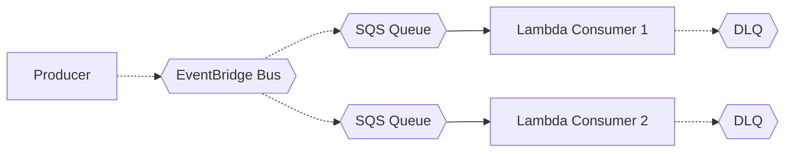

# Pattern: Event-Driven Async

## When to use
- Background job processing (email send, report generation, file processing)
- Decoupled producer/consumer where latency tolerance is seconds-to-minutes
- Fan-out from a single event to multiple consumers

## Not when
- Synchronous request-response needed → `serverless-rest-api` or `three-tier-containerized`
- Sub-second latency required → Kinesis streaming → `stream-processing`
- Long-running batch jobs (>15 min) → `batch-processing`

## Components
- EventBridge default bus (+ custom bus for workload-specific events)
- SQS standard queue per consumer + DLQ
- Lambda consumers (one per event type / per queue)
- SNS topic for fan-out when >1 consumer per event
- CloudWatch Logs per Lambda

## Parameters
| Interview input | Knob |
|---|---|
| `environments` | separate EventBridge bus + queues per env |
| `region` | region-local |
| `traffic` | Lambda concurrency; SQS visibility timeout derived from Lambda timeout |
| `data_sensitivity` | KMS CMK on queues + bus when ≥PII; SNS topic SSE with CMK |
| `auth` | n/a (internal workflow) |

## Terraform layout
Flat — no modules.

## WAF pillar annotations
- **Reliability:** DLQ required (maxReceiveCount=5); Lambda retries 2 + DLQ catches rest.
- **Performance:** Graviton Lambda; batch size tuned (10 for low-latency, 100 for throughput).
- **Cost:** No idle resources; SQS long-polling (receive wait 20s).
- **Ops Excellence:** Alarms on DLQ depth, Lambda errors, Lambda throttles.
- **Sustainability:** Lambda Graviton; no always-on compute.
- **Security:** Queue KMS SSE; IAM scoped to specific queue ARNs.
- **Privacy:** Message retention max 14d (SQS) / 7d (Kinesis); DLQ retention identical.

## Variations
- **+ SNS fan-out:** one SNS topic with SQS subscribers per consumer
- **+ EventBridge pipes:** source → filter → target for transformed pipelines
- **FIFO queue:** `queue.fifo` with content-based dedup when ordering matters

## Scope boundary
This pattern scopes to a single workload. The following controls are **account-scope** and handled by the `account-baseline` pattern (apply that first):
- CloudTrail (A.8.15) · GuardDuty (A.8.7) · Security Hub + standards (A.8.16) · AWS Config · IAM account password policy (A.8.5) · EBS encryption by default (A.8.24 account-level) · Access Analyzer · Inspector v2 · Macie.

Audit FAILs on these clauses against a workload module are expected — they're not gaps in this pattern.

## Mermaid snippet


## Terraform (complete)

### `versions.tf`
```hcl
terraform {
  required_version = ">= 1.7"
  required_providers { aws = { source = "hashicorp/aws", version = "~> 5.0" } }
}
```

### `variables.tf`
```hcl
variable "workload" { type = string }
variable "environment" { type = string }
variable "owner" { type = string }
variable "cost_center" { type = string }
variable "repository" { type = string }
variable "region" { type = string }
variable "data_sensitivity" { type = string }
variable "lambda_concurrency" { type = number }
variable "event_types" {
  type        = list(string)
  description = "e.g., [\"order.created\", \"order.shipped\"]"
}
```

### `main.tf`
```hcl
provider "aws" {
  region = var.region
  default_tags {
    tags = {
      Environment = var.environment
      Workload    = var.workload
      Owner       = var.owner
      CostCenter  = var.cost_center
      ManagedBy   = "terraform"
      Repository  = var.repository
    }
  }
}

locals {
  use_cmk = contains(["PII", "regulated-PII"], var.data_sensitivity)
}

resource "aws_kms_key" "events" {
  count                   = local.use_cmk ? 1 : 0
  description             = "${var.workload}-${var.environment} events CMK"
  deletion_window_in_days = 30
  enable_key_rotation     = true
}

resource "aws_cloudwatch_event_bus" "this" {
  name               = "${var.workload}-${var.environment}"
  kms_key_identifier = local.use_cmk ? aws_kms_key.events[0].arn : null
}

resource "aws_sqs_queue" "dlq" {
  for_each                  = toset(var.event_types)
  name                      = "${var.workload}-${var.environment}-${replace(each.key, ".", "-")}-dlq"
  message_retention_seconds = 1209600 # 14 days
  kms_master_key_id         = local.use_cmk ? aws_kms_key.events[0].id : null
}

resource "aws_sqs_queue" "queue" {
  for_each                   = toset(var.event_types)
  name                       = "${var.workload}-${var.environment}-${replace(each.key, ".", "-")}"
  visibility_timeout_seconds = 60
  message_retention_seconds  = 345600 # 4 days
  receive_wait_time_seconds  = 20
  kms_master_key_id          = local.use_cmk ? aws_kms_key.events[0].id : null
  redrive_policy = jsonencode({
    deadLetterTargetArn = aws_sqs_queue.dlq[each.key].arn
    maxReceiveCount     = 5
  })
}

resource "aws_cloudwatch_event_rule" "to_queue" {
  for_each       = toset(var.event_types)
  name           = "${var.workload}-${var.environment}-${replace(each.key, ".", "-")}"
  event_bus_name = aws_cloudwatch_event_bus.this.name
  event_pattern  = jsonencode({ "detail-type" = [each.key] })
}

resource "aws_cloudwatch_event_target" "to_queue" {
  for_each       = toset(var.event_types)
  rule           = aws_cloudwatch_event_rule.to_queue[each.key].name
  event_bus_name = aws_cloudwatch_event_bus.this.name
  target_id      = "sqs"
  arn            = aws_sqs_queue.queue[each.key].arn
}

resource "aws_sqs_queue_policy" "eventbridge_can_send" {
  for_each  = toset(var.event_types)
  queue_url = aws_sqs_queue.queue[each.key].id
  policy = jsonencode({
    Version = "2012-10-17"
    Statement = [{
      Effect    = "Allow"
      Principal = { Service = "events.amazonaws.com" }
      Action    = "sqs:SendMessage"
      Resource  = aws_sqs_queue.queue[each.key].arn
      Condition = { ArnEquals = { "aws:SourceArn" = aws_cloudwatch_event_rule.to_queue[each.key].arn } }
    }]
  })
}

resource "aws_iam_role" "lambda" {
  for_each = toset(var.event_types)
  name     = "${var.workload}-${var.environment}-${replace(each.key, ".", "-")}-lambda"
  assume_role_policy = jsonencode({
    Version   = "2012-10-17"
    Statement = [{ Action = "sts:AssumeRole", Effect = "Allow", Principal = { Service = "lambda.amazonaws.com" } }]
  })
}

resource "aws_iam_role_policy" "lambda" {
  for_each = toset(var.event_types)
  role     = aws_iam_role.lambda[each.key].id
  policy = jsonencode({
    Version = "2012-10-17"
    Statement = [
      { Effect = "Allow", Action = ["logs:CreateLogStream", "logs:PutLogEvents"], Resource = "arn:aws:logs:${var.region}:*:log-group:/aws/lambda/*" },
      { Effect = "Allow", Action = ["sqs:ReceiveMessage", "sqs:DeleteMessage", "sqs:GetQueueAttributes"], Resource = aws_sqs_queue.queue[each.key].arn }
    ]
  })
}

data "archive_file" "consumer" {
  for_each    = toset(var.event_types)
  type        = "zip"
  source_dir  = "${path.module}/lambdas/${replace(each.key, ".", "-")}"
  output_path = "${path.module}/build/${replace(each.key, ".", "-")}.zip"
}

resource "aws_lambda_function" "consumer" {
  for_each                       = toset(var.event_types)
  function_name                  = "${var.workload}-${var.environment}-${replace(each.key, ".", "-")}"
  role                           = aws_iam_role.lambda[each.key].arn
  handler                        = "index.handler"
  runtime                        = "python3.12"
  architectures                  = ["arm64"]
  memory_size                    = 512
  timeout                        = 30
  filename                       = data.archive_file.consumer[each.key].output_path
  source_code_hash               = data.archive_file.consumer[each.key].output_base64sha256
  reserved_concurrent_executions = var.lambda_concurrency
}

resource "aws_lambda_event_source_mapping" "sqs" {
  for_each                           = toset(var.event_types)
  event_source_arn                   = aws_sqs_queue.queue[each.key].arn
  function_name                      = aws_lambda_function.consumer[each.key].arn
  batch_size                         = 10
  maximum_batching_window_in_seconds = 2
}

resource "aws_cloudwatch_log_group" "lambda" {
  for_each          = toset(var.event_types)
  name              = "/aws/lambda/${var.workload}-${var.environment}-${replace(each.key, ".", "-")}"
  retention_in_days = var.environment == "prod" ? 365 : 30
}

resource "aws_cloudwatch_metric_alarm" "dlq_depth" {
  for_each            = toset(var.event_types)
  alarm_name          = "${var.workload}-${var.environment}-${replace(each.key, ".", "-")}-dlq-depth"
  metric_name         = "ApproximateNumberOfMessagesVisible"
  namespace           = "AWS/SQS"
  statistic           = "Maximum"
  period              = 300
  evaluation_periods  = 1
  threshold           = 1
  comparison_operator = "GreaterThanOrEqualToThreshold"
  dimensions          = { QueueName = aws_sqs_queue.dlq[each.key].name }
}
```

### `outputs.tf`
```hcl
output "event_bus_name" { value = aws_cloudwatch_event_bus.this.name }
output "queue_urls" { value = { for t in var.event_types : t => aws_sqs_queue.queue[t].url } }
```

### `terraform.tfvars.example`
```hcl
workload           = "acme-orders"
environment        = "prod"
owner              = "orders-team"
cost_center        = "9876"
repository         = "github.com/acme/orders"
region             = "ap-southeast-1"
data_sensitivity   = "internal"
lambda_concurrency = 100
event_types        = ["order.created", "order.shipped", "order.cancelled"]
```
