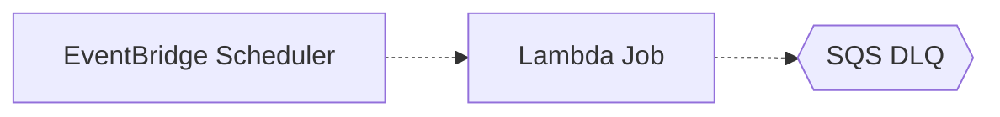

# Pattern: Scheduled Jobs

## When to use
- Single-purpose cron-like jobs (cleanup, daily report, sync from external API)
- Short-running (< 15 min) — Lambda target
- Medium-running — ECS Fargate task target
- Multiple independent schedules without orchestration complexity

## Not when
- Multi-step workflow with dependencies → `batch-processing`
- Continuous event processing → `event-driven-async`
- Pure on-demand invocation → `serverless-rest-api`

## Components
- EventBridge Scheduler (not the legacy EventBridge rules — Scheduler supports time zones and one-time schedules)
- Lambda function (for jobs <15 min)
- Or ECS Fargate task (for longer jobs — run via Scheduler target `ecs:RunTask`)
- Dead-letter SQS queue for failed invocations
- CloudWatch Logs

## Parameters
| Interview input | Knob |
|---|---|
| `environments` | per-env schedule + target |
| `region` | region-local |
| `traffic` | n/a for scheduled |
| `data_sensitivity` | CMK on Lambda env vars, DLQ |
| `auth` | n/a |

## Terraform layout
Flat.

## WAF pillar annotations
- **Reliability:** DLQ attached to Scheduler target; Lambda retries 2; failure alarms.
- **Performance:** Graviton Lambda; scheduled in correct time zone (no UTC surprises).
- **Cost:** Zero idle cost; Lambda only charged per invocation.
- **Ops Excellence:** Alarms on schedule failures + DLQ depth; execution history in CloudWatch.
- **Sustainability:** Graviton; Lambda scales to zero by definition.
- **Security:** IAM scoped per target; schedule payloads encrypted when PII+.
- **Privacy:** n/a for most scheduled jobs; retention of any produced data configurable.

## Variations
- **ECS task target:** for jobs needing >15 min or custom runtime
- **Multiple schedules in a group:** use `aws_scheduler_schedule_group` when jobs share lifecycle
- **One-time schedule:** use `at(...)` expression for delayed execution

## Scope boundary
This pattern scopes to a single workload. The following controls are **account-scope** and handled by the `account-baseline` pattern (apply that first):
- CloudTrail (A.8.15) · GuardDuty (A.8.7) · Security Hub + standards (A.8.16) · AWS Config · IAM account password policy (A.8.5) · EBS encryption by default (A.8.24 account-level) · Access Analyzer · Inspector v2 · Macie.

Audit FAILs on these clauses against a workload module are expected — they're not gaps in this pattern.

## Mermaid snippet


## Terraform (complete)

### `versions.tf`
```hcl
terraform {
  required_version = ">= 1.7"
  required_providers {
    aws = {
      source  = "hashicorp/aws"
      version = "~> 5.0"
    }
  }
}
```

### `variables.tf`
```hcl
variable "workload" {
  type = string
}
variable "environment" {
  type = string
}
variable "owner" {
  type = string
}
variable "cost_center" {
  type = string
}
variable "repository" {
  type = string
}
variable "region" {
  type = string
}
variable "data_sensitivity" {
  type = string
}
variable "jobs" {
  type = map(object({
    schedule_expression = string
    schedule_timezone   = string
    description         = string
  }))
  description = "Map of job name → schedule config"
}
```

### `main.tf`
```hcl
provider "aws" {
  region = var.region
  default_tags {
    tags = {
      Environment = var.environment
      Workload    = var.workload
      Owner       = var.owner
      CostCenter  = var.cost_center
      ManagedBy   = "terraform"
      Repository  = var.repository
    }
  }
}

locals {
  use_cmk = contains(["PII", "regulated-PII"], var.data_sensitivity)
}

resource "aws_kms_key" "jobs" {
  count                   = local.use_cmk ? 1 : 0
  description             = "${var.workload}-${var.environment} jobs CMK"
  deletion_window_in_days = 30
  enable_key_rotation     = true
}

resource "aws_sqs_queue" "dlq" {
  for_each                  = var.jobs
  name                      = "${var.workload}-${var.environment}-${each.key}-dlq"
  message_retention_seconds = 1209600
  kms_master_key_id         = local.use_cmk ? aws_kms_key.jobs[0].id : null
}

resource "aws_iam_role" "lambda" {
  for_each = var.jobs
  name     = "${var.workload}-${var.environment}-${each.key}-lambda"
  assume_role_policy = jsonencode({
    Version   = "2012-10-17"
    Statement = [{ Action = "sts:AssumeRole", Effect = "Allow", Principal = { Service = "lambda.amazonaws.com" } }]
  })
}

resource "aws_iam_role_policy" "lambda" {
  for_each = var.jobs
  role     = aws_iam_role.lambda[each.key].id
  policy = jsonencode({
    Version = "2012-10-17"
    Statement = [
      { Effect = "Allow", Action = ["logs:CreateLogStream", "logs:PutLogEvents"], Resource = "arn:aws:logs:${var.region}:*:log-group:/aws/lambda/*" }
    ]
  })
}

data "archive_file" "job" {
  for_each    = var.jobs
  type        = "zip"
  source_dir  = "${path.module}/lambdas/${each.key}"
  output_path = "${path.module}/build/${each.key}.zip"
}

resource "aws_lambda_function" "job" {
  for_each         = var.jobs
  function_name    = "${var.workload}-${var.environment}-${each.key}"
  role             = aws_iam_role.lambda[each.key].arn
  handler          = "index.handler"
  runtime          = "python3.12"
  architectures    = ["arm64"]
  memory_size      = 512
  timeout          = 300
  filename         = data.archive_file.job[each.key].output_path
  source_code_hash = data.archive_file.job[each.key].output_base64sha256
  dead_letter_config {
    target_arn = aws_sqs_queue.dlq[each.key].arn
  }
}

resource "aws_lambda_permission" "scheduler_invoke" {
  for_each      = var.jobs
  action        = "lambda:InvokeFunction"
  function_name = aws_lambda_function.job[each.key].function_name
  principal     = "scheduler.amazonaws.com"
  source_arn    = aws_scheduler_schedule.job[each.key].arn
}

resource "aws_iam_role" "scheduler" {
  for_each = var.jobs
  name     = "${var.workload}-${var.environment}-${each.key}-scheduler"
  assume_role_policy = jsonencode({
    Version   = "2012-10-17"
    Statement = [{ Action = "sts:AssumeRole", Effect = "Allow", Principal = { Service = "scheduler.amazonaws.com" } }]
  })
}

resource "aws_iam_role_policy" "scheduler" {
  for_each = var.jobs
  role     = aws_iam_role.scheduler[each.key].id
  policy = jsonencode({
    Version = "2012-10-17"
    Statement = [
      { Effect = "Allow", Action = "lambda:InvokeFunction", Resource = aws_lambda_function.job[each.key].arn },
      { Effect = "Allow", Action = "sqs:SendMessage", Resource = aws_sqs_queue.dlq[each.key].arn }
    ]
  })
}

resource "aws_scheduler_schedule" "job" {
  for_each                     = var.jobs
  name                         = "${var.workload}-${var.environment}-${each.key}"
  description                  = each.value.description
  schedule_expression          = each.value.schedule_expression
  schedule_expression_timezone = each.value.schedule_timezone
  flexible_time_window {
    mode = "OFF"
  }
  target {
    arn      = aws_lambda_function.job[each.key].arn
    role_arn = aws_iam_role.scheduler[each.key].arn
    dead_letter_config {
      arn = aws_sqs_queue.dlq[each.key].arn
    }
    retry_policy {
      maximum_event_age_in_seconds = 600
      maximum_retry_attempts       = 2
    }
  }
}

resource "aws_cloudwatch_log_group" "lambda" {
  for_each          = var.jobs
  name              = "/aws/lambda/${var.workload}-${var.environment}-${each.key}"
  retention_in_days = var.environment == "prod" ? 365 : 30
}

resource "aws_cloudwatch_metric_alarm" "dlq" {
  for_each            = var.jobs
  alarm_name          = "${var.workload}-${var.environment}-${each.key}-dlq"
  metric_name         = "ApproximateNumberOfMessagesVisible"
  namespace           = "AWS/SQS"
  statistic           = "Maximum"
  period              = 300
  evaluation_periods  = 1
  threshold           = 1
  comparison_operator = "GreaterThanOrEqualToThreshold"
  dimensions          = { QueueName = aws_sqs_queue.dlq[each.key].name }
}
```

### `outputs.tf`
```hcl
output "job_arns" {
  value = { for k, _ in var.jobs : k => aws_lambda_function.job[k].arn }
}
```

### `terraform.tfvars.example`
```hcl
workload         = "acme-ops"
environment      = "prod"
owner            = "platform-team"
cost_center      = "1234"
repository       = "github.com/acme/ops-jobs"
region           = "ap-southeast-1"
data_sensitivity = "internal"
jobs = {
  nightly-cleanup = {
    schedule_expression = "cron(0 2 * * ? *)"
    schedule_timezone   = "Asia/Singapore"
    description         = "Expire old S3 scratch files"
  }
  hourly-sync = {
    schedule_expression = "rate(1 hour)"
    schedule_timezone   = "UTC"
    description         = "Sync from external vendor API"
  }
}
```
