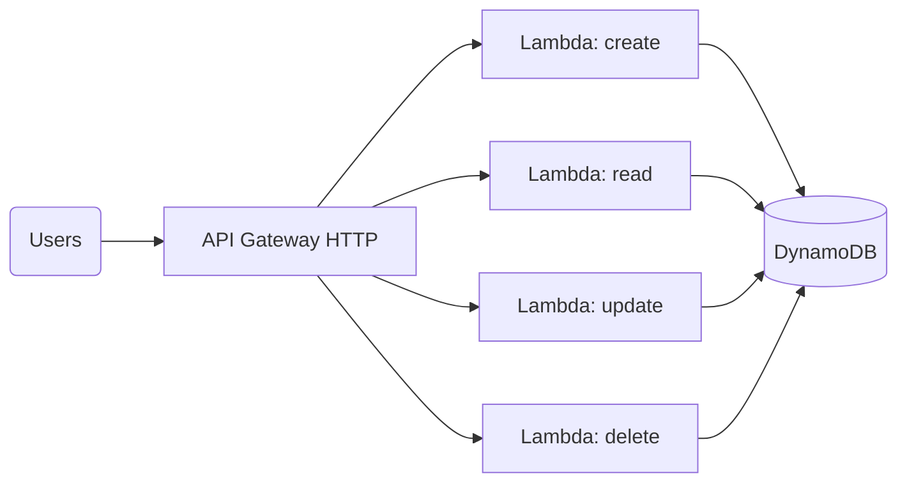

# Pattern: Serverless REST API

## When to use
- CRUD-style HTTP API backed by a key-value or document store
- Spiky / low-baseline traffic where Fargate would be idle most of the time
- Teams wanting zero infra to maintain

## Not when
- Needs long-lived connections (WebSockets with heavy state) → `three-tier-containerized`
- Relational queries across multiple tables → `three-tier-containerized` (RDS) or `data-lake`
- Sustained very high throughput (>1000 RPS steady) where per-request Lambda billing becomes unfavourable → `three-tier-containerized`

## Components
- API Gateway (HTTP API v2, not REST v1 — cheaper + faster)
- Lambda (one function per API operation is the recommended layout; a single "Lambdalith" is an accepted variation)
- DynamoDB (single-table design by default; one table per aggregate root as a variation)
- CloudWatch Logs (per Lambda + per API Gateway stage)
- Optional: Cognito authoriser (when `auth = Cognito`)

## Parameters
| Interview input | Knob |
|---|---|
| `environments` | API Gateway stage per env; Lambda aliases per env |
| `region` | single region; DynamoDB tables local to region |
| `traffic` | Lambda reserved concurrency (20/100/500); API Gateway throttling; DynamoDB mode (on-demand default; provisioned for `high` with autoscaling) |
| `data_sensitivity` | `PII+` enables DynamoDB KMS CMK (not AWS-managed key), enables API Gateway access logging with PII field redaction note in ADR |
| `auth` | `none`/`API keys` → no authoriser; `Cognito` → adds user pool + authoriser; `existing IdP` → JWT authoriser pointing at external issuer |

## Terraform layout
Flat with a per-function structure:
```
main.tf, variables.tf, outputs.tf, versions.tf, terraform.tfvars.example
lambdas/
├── create-item/   (handler source — user provides)
├── get-item/
├── list-items/
├── update-item/
└── delete-item/
```
Generated Terraform provisions 5 Lambdas by default (CRUD); `lambdas/*/index.py` stubs are generated so `terraform apply` works end-to-end with placeholder handlers.

## WAF pillar annotations
- **Reliability:** Lambda has built-in HA across AZs; DynamoDB multi-AZ + PITR enabled; DLQ (SQS) attached to every async Lambda destination.
- **Performance:** ARM64 Lambda (Graviton); DynamoDB on-demand scales automatically; API Gateway caching for `traffic=high`.
- **Cost:** On-demand for low/medium traffic; provisioned + autoscaling when sustained high. No NAT Gateway (Lambdas are public unless VPC-bound).
- **Ops Excellence:** Log retention 30d non-prod / 365d prod; alarms on 5xx rate, Lambda errors, Lambda duration p99.
- **Sustainability:** Graviton Lambda; no always-on compute; DynamoDB TTL for ephemeral records.
- **Security:** API Gateway access logs with execution ARN redaction; least-privilege IAM per Lambda; CMK-SSE on DynamoDB when `data_sensitivity ≥ PII`.
- **Privacy:** DynamoDB TTL configurable for data retention; region-local by default.

## Variations
- **+ Cognito auth:** swap `authorization_type = "NONE"` → `"JWT"` with Cognito user pool issuer
- **+ async fan-out:** add SNS/SQS between API and worker Lambda → compose with `event-driven-async`
- **Lambdalith:** single Lambda handling all routes instead of per-route; annotate this trade-off in ADR

## Scope boundary
This pattern scopes to a single workload. The following controls are **account-scope** and handled by the `account-baseline` pattern (apply that first):
- CloudTrail (A.8.15) · GuardDuty (A.8.7) · Security Hub + standards (A.8.16) · AWS Config · IAM account password policy (A.8.5) · EBS encryption by default (A.8.24 account-level) · Access Analyzer · Inspector v2 · Macie.

Audit FAILs on these clauses against a workload module are expected — they're not gaps in this pattern.

## Mermaid snippet


## Terraform (complete)

### `versions.tf`
```hcl
terraform {
  required_version = ">= 1.7"
  required_providers {
    aws = { source = "hashicorp/aws", version = "~> 5.0" }
  }
}
```

### `variables.tf`
```hcl
variable "workload" {
  type = string
}

variable "environment" {
  type = string
}

variable "owner" {
  type = string
}

variable "cost_center" {
  type = string
}

variable "repository" {
  type = string
}

variable "region" {
  type = string
}

variable "lambda_concurrency" {
  type        = number
  description = "reserved concurrency per function"
}

variable "data_sensitivity" {
  type        = string
  description = "none | internal | PII | regulated-PII"
}

variable "cognito_user_pool_arn" {
  type    = string
  default = null
}
```

### `main.tf`
```hcl
provider "aws" {
  region = var.region
  default_tags {
    tags = {
      Environment = var.environment
      Workload    = var.workload
      Owner       = var.owner
      CostCenter  = var.cost_center
      ManagedBy   = "terraform"
      Repository  = var.repository
    }
  }
}

locals {
  operations   = ["create", "get", "list", "update", "delete"]
  methods      = { create = "POST", get = "GET", list = "GET", update = "PUT", delete = "DELETE" }
  paths        = { create = "/items", get = "/items/{id}", list = "/items", update = "/items/{id}", delete = "/items/{id}" }
  use_cmk      = contains(["PII", "regulated-PII"], var.data_sensitivity)
}

resource "aws_kms_key" "ddb" {
  count                   = local.use_cmk ? 1 : 0
  description             = "${var.workload}-${var.environment} DynamoDB CMK"
  deletion_window_in_days = 30
  enable_key_rotation     = true
}

resource "aws_dynamodb_table" "items" {
  name         = "${var.workload}-${var.environment}-items"
  billing_mode = "PAY_PER_REQUEST"
  hash_key     = "pk"
  range_key    = "sk"

  attribute { name = "pk", type = "S" }
  attribute { name = "sk", type = "S" }

  point_in_time_recovery { enabled = true }

  server_side_encryption {
    enabled     = true
    kms_key_arn = local.use_cmk ? aws_kms_key.ddb[0].arn : null
  }
}

resource "aws_iam_role" "lambda" {
  for_each = toset(local.operations)
  name     = "${var.workload}-${var.environment}-${each.key}-lambda"
  assume_role_policy = jsonencode({
    Version = "2012-10-17"
    Statement = [{
      Action    = "sts:AssumeRole"
      Effect    = "Allow"
      Principal = { Service = "lambda.amazonaws.com" }
    }]
  })
}

resource "aws_iam_role_policy" "lambda_ddb" {
  for_each = toset(local.operations)
  role     = aws_iam_role.lambda[each.key].id
  policy = jsonencode({
    Version = "2012-10-17"
    Statement = [
      {
        Effect = "Allow"
        Action = [
          "logs:CreateLogStream",
          "logs:PutLogEvents"
        ]
        Resource = "arn:aws:logs:${var.region}:*:log-group:/aws/lambda/${var.workload}-${var.environment}-*:*"
      },
      {
        Effect   = "Allow"
        Action   = each.key == "list" || each.key == "get" ? ["dynamodb:Query", "dynamodb:GetItem"] : ["dynamodb:PutItem", "dynamodb:UpdateItem", "dynamodb:DeleteItem", "dynamodb:GetItem"]
        Resource = aws_dynamodb_table.items.arn
      }
    ]
  })
}

data "archive_file" "lambda" {
  for_each    = toset(local.operations)
  type        = "zip"
  source_dir  = "${path.module}/lambdas/${each.key}"
  output_path = "${path.module}/build/${each.key}.zip"
}

resource "aws_lambda_function" "handler" {
  for_each         = toset(local.operations)
  function_name    = "${var.workload}-${var.environment}-${each.key}"
  role             = aws_iam_role.lambda[each.key].arn
  handler          = "index.handler"
  runtime          = "python3.12"
  architectures    = ["arm64"]
  memory_size      = 512
  timeout          = 10
  filename         = data.archive_file.lambda[each.key].output_path
  source_code_hash = data.archive_file.lambda[each.key].output_base64sha256
  reserved_concurrent_executions = var.lambda_concurrency

  environment {
    variables = { TABLE_NAME = aws_dynamodb_table.items.name }
  }
}

resource "aws_cloudwatch_log_group" "lambda" {
  for_each          = toset(local.operations)
  name              = "/aws/lambda/${var.workload}-${var.environment}-${each.key}"
  retention_in_days = var.environment == "prod" ? 365 : 30
}

resource "aws_apigatewayv2_api" "http" {
  name          = "${var.workload}-${var.environment}"
  protocol_type = "HTTP"
}

resource "aws_apigatewayv2_authorizer" "cognito" {
  count            = var.cognito_user_pool_arn == null ? 0 : 1
  api_id           = aws_apigatewayv2_api.http.id
  authorizer_type  = "JWT"
  identity_sources = ["$request.header.Authorization"]
  name             = "cognito"
  jwt_configuration {
    audience = ["*"]
    issuer   = var.cognito_user_pool_arn
  }
}

resource "aws_apigatewayv2_integration" "lambda" {
  for_each               = toset(local.operations)
  api_id                 = aws_apigatewayv2_api.http.id
  integration_type       = "AWS_PROXY"
  integration_uri        = aws_lambda_function.handler[each.key].invoke_arn
  payload_format_version = "2.0"
}

resource "aws_apigatewayv2_route" "op" {
  for_each           = toset(local.operations)
  api_id             = aws_apigatewayv2_api.http.id
  route_key          = "${local.methods[each.key]} ${local.paths[each.key]}"
  target             = "integrations/${aws_apigatewayv2_integration.lambda[each.key].id}"
  authorization_type = var.cognito_user_pool_arn == null ? "NONE" : "JWT"
  authorizer_id      = var.cognito_user_pool_arn == null ? null : aws_apigatewayv2_authorizer.cognito[0].id
}

resource "aws_apigatewayv2_stage" "this" {
  api_id      = aws_apigatewayv2_api.http.id
  name        = var.environment
  auto_deploy = true

  default_route_settings {
    throttling_burst_limit = 5000
    throttling_rate_limit  = 10000
  }

  access_log_settings {
    destination_arn = aws_cloudwatch_log_group.apigw.arn
    format          = jsonencode({
      requestId       = "$context.requestId"
      ip              = "$context.identity.sourceIp"
      requestTime     = "$context.requestTime"
      routeKey        = "$context.routeKey"
      status          = "$context.status"
      protocol        = "$context.protocol"
      responseLength  = "$context.responseLength"
    })
  }
}

resource "aws_cloudwatch_log_group" "apigw" {
  name              = "/aws/apigateway/${var.workload}-${var.environment}"
  retention_in_days = var.environment == "prod" ? 365 : 30
}

resource "aws_lambda_permission" "apigw_invoke" {
  for_each      = toset(local.operations)
  action        = "lambda:InvokeFunction"
  function_name = aws_lambda_function.handler[each.key].function_name
  principal     = "apigateway.amazonaws.com"
  source_arn    = "${aws_apigatewayv2_api.http.execution_arn}/*/*"
}
```

### `outputs.tf`
```hcl
output "api_endpoint" {
  value = "${aws_apigatewayv2_api.http.api_endpoint}/${var.environment}"
}

output "table_name" {
  value = aws_dynamodb_table.items.name
}
```

### `lambdas/*/index.py` (stub — one per operation)
```python
import json, os, boto3
TABLE = os.environ["TABLE_NAME"]
ddb = boto3.resource("dynamodb").Table(TABLE)

def handler(event, context):
    # TODO: implement operation logic
    return {"statusCode": 200, "body": json.dumps({"ok": True, "op": os.environ.get("AWS_LAMBDA_FUNCTION_NAME")})}
```

### `terraform.tfvars.example`
```hcl
workload           = "acme-orders"
environment        = "prod"
owner              = "orders-team"
cost_center        = "4567"
repository         = "github.com/acme/orders-api"
region             = "ap-southeast-1"
lambda_concurrency = 100
data_sensitivity   = "PII"
# cognito_user_pool_arn = "arn:aws:cognito-idp:..."
```
