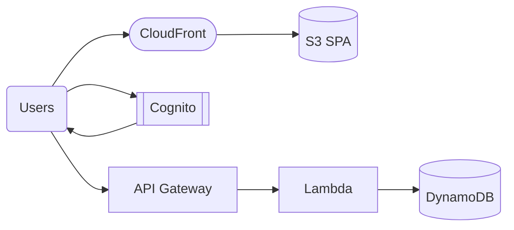

# Pattern: SPA + Auth

## When to use
- Single-page app (React, Vue, Svelte) with user sign-up / sign-in
- Backend API called from the SPA with JWT-based auth
- User management delegated to Cognito (or an existing IdP via federation)

## Not when
- Public static site, no auth → `static-site-cdn`
- Server-rendered app → `three-tier-containerized`
- Backend needs relational DB → compose with `three-tier-containerized` for backend

## Components
- S3 bucket + CloudFront + OAC + ACM (same as `static-site-cdn`, reused)
- Cognito User Pool + User Pool Client (app client)
- Cognito Identity Pool (only if app needs direct AWS access — not default)
- API Gateway HTTP API with JWT authoriser pointing at Cognito User Pool
- Lambda handlers (same structure as `serverless-rest-api`)
- DynamoDB table for app data

## Parameters
| Interview input | Knob |
|---|---|
| `environments` | one user pool per env; separate domain per env |
| `region` | region-local |
| `traffic` | Lambda concurrency; API Gateway throttling |
| `data_sensitivity` | KMS CMK for DynamoDB; Cognito advanced security when ≥PII |
| `auth` | `Cognito` (this pattern assumes Cognito); `existing IdP` uses Cognito federation |

## Terraform layout
Flat with `lambdas/` subdir (mirrors `serverless-rest-api`):
```
main.tf, variables.tf, outputs.tf, versions.tf, terraform.tfvars.example
lambdas/
├── me/
├── list-items/
├── create-item/
└── delete-item/
```

## WAF pillar annotations
- **Reliability:** Cognito multi-AZ by default; API Gateway and Lambda HA; DynamoDB PITR on.
- **Performance:** ARM64 Lambda; API Gateway regional (not edge-optimised — CloudFront already fronts).
- **Cost:** User pool priced per MAU; Lambda on-demand; DynamoDB on-demand.
- **Ops Excellence:** Cognito sign-in events to CloudWatch; log retention 30/365d; API access logs.
- **Sustainability:** Graviton; no idle compute.
- **Security:** Cognito advanced security features ON when `data_sensitivity ≥ PII`; password policy enforced; MFA optional (recommended: required for PII+).
- **Privacy:** User pool region-local; Cognito user data exportable for DSR requests.

## Variations
- **+ existing IdP federation (SAML / OIDC):** add `aws_cognito_identity_provider` — user provides IdP metadata
- **+ hosted UI:** use Cognito hosted UI instead of app-built sign-in screens
- **+ custom domain for hosted UI:** requires ACM in us-east-1 + Route 53

## Scope boundary
This pattern scopes to a single workload. The following controls are **account-scope** and handled by the `account-baseline` pattern (apply that first):
- CloudTrail (A.8.15) · GuardDuty (A.8.7) · Security Hub + standards (A.8.16) · AWS Config · IAM account password policy (A.8.5) · EBS encryption by default (A.8.24 account-level) · Access Analyzer · Inspector v2 · Macie.

Audit FAILs on these clauses against a workload module are expected — they're not gaps in this pattern.

## Mermaid snippet


## Terraform (complete)

### `versions.tf`
```hcl
terraform {
  required_version = ">= 1.7"
  required_providers { aws = { source = "hashicorp/aws", version = "~> 5.0" } }
}
```

### `variables.tf`
```hcl
variable "workload" { type = string }
variable "environment" { type = string }
variable "owner" { type = string }
variable "cost_center" { type = string }
variable "repository" { type = string }
variable "region" { type = string }
variable "data_sensitivity" { type = string }
variable "lambda_concurrency" { type = number }
variable "domain_name" {
  type    = string
  default = null
}
variable "hosted_zone_id" {
  type    = string
  default = null
}
variable "mfa_configuration" {
  type        = string
  default     = "OPTIONAL"
  description = "OFF | OPTIONAL | ON"
}
variable "callback_urls" { type = list(string) }
variable "logout_urls" { type = list(string) }
```

### `main.tf`
```hcl
provider "aws" {
  region = var.region
  default_tags {
    tags = {
      Environment = var.environment
      Workload    = var.workload
      Owner       = var.owner
      CostCenter  = var.cost_center
      ManagedBy   = "terraform"
      Repository  = var.repository
    }
  }
}

provider "aws" {
  alias  = "us_east_1"
  region = "us-east-1"
  default_tags {
    tags = {
      Workload  = var.workload
      ManagedBy = "terraform"
    }
  }
}

locals {
  use_cmk           = contains(["PII", "regulated-PII"], var.data_sensitivity)
  advanced_security = contains(["PII", "regulated-PII"], var.data_sensitivity) ? "ENFORCED" : "OFF"
  operations        = ["me", "list-items", "create-item", "delete-item"]
}

resource "aws_cognito_user_pool" "this" {
  name                     = "${var.workload}-${var.environment}"
  mfa_configuration        = var.mfa_configuration
  deletion_protection      = var.environment == "prod" ? "ACTIVE" : "INACTIVE"
  auto_verified_attributes = ["email"]
  password_policy {
    minimum_length                   = 12
    require_lowercase                = true
    require_numbers                  = true
    require_symbols                  = true
    require_uppercase                = true
    temporary_password_validity_days = 3
  }
  account_recovery_setting {
    recovery_mechanism {
      name     = "verified_email"
      priority = 1
    }
  }
  user_pool_add_ons {
    advanced_security_mode = local.advanced_security
  }
  software_token_mfa_configuration {
    enabled = var.mfa_configuration != "OFF"
  }
}

resource "aws_cognito_user_pool_client" "this" {
  name                                 = "${var.workload}-${var.environment}"
  user_pool_id                         = aws_cognito_user_pool.this.id
  generate_secret                      = false
  allowed_oauth_flows                  = ["code"]
  allowed_oauth_flows_user_pool_client = true
  allowed_oauth_scopes                 = ["openid", "email", "profile"]
  callback_urls                        = var.callback_urls
  logout_urls                          = var.logout_urls
  supported_identity_providers         = ["COGNITO"]
  explicit_auth_flows                  = ["ALLOW_USER_SRP_AUTH", "ALLOW_REFRESH_TOKEN_AUTH"]
  access_token_validity                = 1
  id_token_validity                    = 1
  refresh_token_validity               = 30
  token_validity_units {
    access_token  = "hours"
    id_token      = "hours"
    refresh_token = "days"
  }
}

resource "aws_kms_key" "ddb" {
  count                   = local.use_cmk ? 1 : 0
  description             = "${var.workload}-${var.environment} DynamoDB CMK"
  deletion_window_in_days = 30
  enable_key_rotation     = true
}

resource "aws_dynamodb_table" "items" {
  name         = "${var.workload}-${var.environment}-items"
  billing_mode = "PAY_PER_REQUEST"
  hash_key     = "pk"
  range_key    = "sk"
  attribute {
    name = "pk"
    type = "S"
  }
  attribute {
    name = "sk"
    type = "S"
  }
  point_in_time_recovery { enabled = true }
  server_side_encryption {
    enabled     = true
    kms_key_arn = local.use_cmk ? aws_kms_key.ddb[0].arn : null
  }
}

resource "aws_iam_role" "lambda" {
  for_each = toset(local.operations)
  name     = "${var.workload}-${var.environment}-${each.key}-lambda"
  assume_role_policy = jsonencode({
    Version   = "2012-10-17"
    Statement = [{ Action = "sts:AssumeRole", Effect = "Allow", Principal = { Service = "lambda.amazonaws.com" } }]
  })
}

resource "aws_iam_role_policy" "lambda" {
  for_each = toset(local.operations)
  role     = aws_iam_role.lambda[each.key].id
  policy = jsonencode({
    Version = "2012-10-17"
    Statement = [
      { Effect = "Allow", Action = ["logs:CreateLogStream", "logs:PutLogEvents"], Resource = "arn:aws:logs:${var.region}:*:log-group:/aws/lambda/*" },
      { Effect = "Allow", Action = ["dynamodb:Query", "dynamodb:GetItem", "dynamodb:PutItem", "dynamodb:DeleteItem"], Resource = aws_dynamodb_table.items.arn }
    ]
  })
}

data "archive_file" "lambda" {
  for_each    = toset(local.operations)
  type        = "zip"
  source_dir  = "${path.module}/lambdas/${each.key}"
  output_path = "${path.module}/build/${each.key}.zip"
}

resource "aws_lambda_function" "handler" {
  for_each                       = toset(local.operations)
  function_name                  = "${var.workload}-${var.environment}-${each.key}"
  role                           = aws_iam_role.lambda[each.key].arn
  handler                        = "index.handler"
  runtime                        = "python3.12"
  architectures                  = ["arm64"]
  memory_size                    = 512
  timeout                        = 10
  filename                       = data.archive_file.lambda[each.key].output_path
  source_code_hash               = data.archive_file.lambda[each.key].output_base64sha256
  reserved_concurrent_executions = var.lambda_concurrency
  environment { variables = { TABLE_NAME = aws_dynamodb_table.items.name } }
}

resource "aws_cloudwatch_log_group" "lambda" {
  for_each          = toset(local.operations)
  name              = "/aws/lambda/${var.workload}-${var.environment}-${each.key}"
  retention_in_days = var.environment == "prod" ? 365 : 30
}

resource "aws_apigatewayv2_api" "http" {
  name          = "${var.workload}-${var.environment}"
  protocol_type = "HTTP"
  cors_configuration {
    allow_origins = var.callback_urls
    allow_methods = ["GET", "POST", "PUT", "DELETE", "OPTIONS"]
    allow_headers = ["Authorization", "Content-Type"]
  }
}

resource "aws_apigatewayv2_authorizer" "cognito" {
  api_id           = aws_apigatewayv2_api.http.id
  authorizer_type  = "JWT"
  identity_sources = ["$request.header.Authorization"]
  name             = "cognito"
  jwt_configuration {
    audience = [aws_cognito_user_pool_client.this.id]
    issuer   = "https://cognito-idp.${var.region}.amazonaws.com/${aws_cognito_user_pool.this.id}"
  }
}

resource "aws_apigatewayv2_integration" "lambda" {
  for_each               = toset(local.operations)
  api_id                 = aws_apigatewayv2_api.http.id
  integration_type       = "AWS_PROXY"
  integration_uri        = aws_lambda_function.handler[each.key].invoke_arn
  payload_format_version = "2.0"
}

locals {
  routes = {
    "me"          = "GET /me"
    "list-items"  = "GET /items"
    "create-item" = "POST /items"
    "delete-item" = "DELETE /items/{id}"
  }
}

resource "aws_apigatewayv2_route" "op" {
  for_each           = toset(local.operations)
  api_id             = aws_apigatewayv2_api.http.id
  route_key          = local.routes[each.key]
  target             = "integrations/${aws_apigatewayv2_integration.lambda[each.key].id}"
  authorization_type = "JWT"
  authorizer_id      = aws_apigatewayv2_authorizer.cognito.id
}

resource "aws_apigatewayv2_stage" "this" {
  api_id      = aws_apigatewayv2_api.http.id
  name        = var.environment
  auto_deploy = true
  default_route_settings {
    throttling_burst_limit = 5000
    throttling_rate_limit  = 10000
  }
}

resource "aws_lambda_permission" "apigw_invoke" {
  for_each      = toset(local.operations)
  action        = "lambda:InvokeFunction"
  function_name = aws_lambda_function.handler[each.key].function_name
  principal     = "apigateway.amazonaws.com"
  source_arn    = "${aws_apigatewayv2_api.http.execution_arn}/*/*"
}

resource "aws_s3_bucket" "spa" {
  bucket = "${var.workload}-${var.environment}-spa"
}

resource "aws_s3_bucket_public_access_block" "spa" {
  bucket                  = aws_s3_bucket.spa.id
  block_public_acls       = true
  block_public_policy     = true
  ignore_public_acls      = true
  restrict_public_buckets = true
}

resource "aws_s3_bucket_versioning" "spa" {
  bucket = aws_s3_bucket.spa.id
  versioning_configuration { status = "Enabled" }
}

resource "aws_cloudfront_origin_access_control" "spa" {
  name                              = "${var.workload}-${var.environment}-spa"
  origin_access_control_origin_type = "s3"
  signing_behavior                  = "always"
  signing_protocol                  = "sigv4"
}

resource "aws_acm_certificate" "spa" {
  count             = var.domain_name == null ? 0 : 1
  provider          = aws.us_east_1
  domain_name       = var.domain_name
  validation_method = "DNS"
  lifecycle { create_before_destroy = true }
}

resource "aws_cloudfront_distribution" "spa" {
  enabled             = true
  is_ipv6_enabled     = true
  default_root_object = "index.html"
  price_class         = "PriceClass_200"
  aliases             = var.domain_name == null ? [] : [var.domain_name]

  origin {
    domain_name              = aws_s3_bucket.spa.bucket_regional_domain_name
    origin_id                = "s3-spa"
    origin_access_control_id = aws_cloudfront_origin_access_control.spa.id
  }

  default_cache_behavior {
    target_origin_id       = "s3-spa"
    viewer_protocol_policy = "redirect-to-https"
    allowed_methods        = ["GET", "HEAD"]
    cached_methods         = ["GET", "HEAD"]
    compress               = true
    default_ttl            = 86400
    max_ttl                = 31536000
    min_ttl                = 0
    forwarded_values {
      query_string = false
      cookies { forward = "none" }
    }
  }

  custom_error_response {
    error_code         = 404
    response_code      = 200
    response_page_path = "/index.html" # SPA routing
  }

  restrictions {
    geo_restriction {
      restriction_type = "none"
    }
  }

  viewer_certificate {
    cloudfront_default_certificate = var.domain_name == null
    acm_certificate_arn            = var.domain_name == null ? null : aws_acm_certificate.spa[0].arn
    ssl_support_method             = var.domain_name == null ? null : "sni-only"
    minimum_protocol_version       = "TLSv1.2_2021"
  }
}

resource "aws_s3_bucket_policy" "spa_oac" {
  bucket = aws_s3_bucket.spa.id
  policy = jsonencode({
    Version = "2012-10-17"
    Statement = [{
      Effect    = "Allow"
      Principal = { Service = "cloudfront.amazonaws.com" }
      Action    = "s3:GetObject"
      Resource  = "${aws_s3_bucket.spa.arn}/*"
      Condition = { StringEquals = { "AWS:SourceArn" = aws_cloudfront_distribution.spa.arn } }
    }]
  })
}

resource "aws_route53_record" "spa" {
  count   = var.domain_name == null ? 0 : 1
  zone_id = var.hosted_zone_id
  name    = var.domain_name
  type    = "A"
  alias {
    name                   = aws_cloudfront_distribution.spa.domain_name
    zone_id                = aws_cloudfront_distribution.spa.hosted_zone_id
    evaluate_target_health = false
  }
}
```

### `outputs.tf`
```hcl
output "cloudfront_domain" { value = aws_cloudfront_distribution.spa.domain_name }
output "api_endpoint" { value = "${aws_apigatewayv2_api.http.api_endpoint}/${var.environment}" }
output "cognito_user_pool_id" { value = aws_cognito_user_pool.this.id }
output "cognito_client_id" { value = aws_cognito_user_pool_client.this.id }
output "cognito_issuer" { value = "https://cognito-idp.${var.region}.amazonaws.com/${aws_cognito_user_pool.this.id}" }
output "table_name" { value = aws_dynamodb_table.items.name }
```

### `terraform.tfvars.example`
```hcl
workload           = "acme-app"
environment        = "prod"
owner              = "product-team"
cost_center        = "5678"
repository         = "github.com/acme/app"
region             = "ap-southeast-1"
data_sensitivity   = "PII"
lambda_concurrency = 100
domain_name        = "app.example.com"
hosted_zone_id     = "Z01234567ABCDEFGHI"
mfa_configuration  = "OPTIONAL"
callback_urls      = ["https://app.example.com/callback"]
logout_urls        = ["https://app.example.com/logout"]
```
