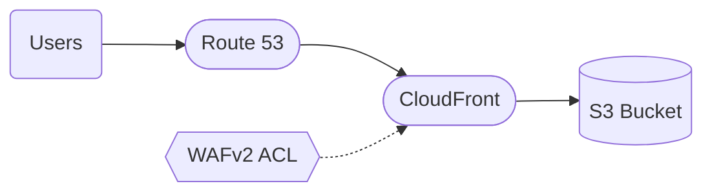

# Pattern: Static Site + CDN

## When to use
- Static single-page app (React, Vue, Svelte, plain HTML) served as files
- Documentation sites, marketing sites, blog-style content
- API-backed SPA where the backend is a separate skill/pattern (`serverless-rest-api` or `spa-auth` if auth needed)

## Not when
- Content requires server-side rendering per request → `serverless-rest-api` with Lambda + CloudFront-proxy, or `three-tier-containerized`
- Site needs auth on specific routes → `spa-auth` (includes Cognito)
- Site has dynamic data in every page → wrong pattern entirely

## Components
- S3 bucket (private, no public access; origin for CloudFront)
- CloudFront distribution with Origin Access Control (OAC, not the legacy OAI)
- WAFv2 Web ACL (`CLOUDFRONT` scope, `us-east-1`) with AWS-managed rule groups — default on, optional off
- ACM certificate in `us-east-1` (CloudFront requirement) — conditional on custom domain provided
- Route 53 A/AAAA records — conditional on custom domain
- S3 bucket policy allowing only CloudFront OAC principal

## Parameters (from interview)
| Interview input | Static-site knob |
|---|---|
| `environments` | one bucket + distribution per env; log retention scales with env |
| `region` | S3 bucket region; ACM still `us-east-1` |
| `traffic` | CloudFront `price_class` (`PriceClass_100` low, `PriceClass_200` medium, `PriceClass_All` high) |
| `data_sensitivity` | `none`/`internal` expected; any PII → wrong pattern, skill should warn |
| `auth` | `none` expected; any auth → redirect to `spa-auth` |

## Usage drivers
Static-site cost scales almost entirely with CloudFront data transfer + request count and S3 requests. Fixed infra (WAFv2 Web ACL $5/mo, KMS CMK $1/mo, alarm $0.10/mo) is the floor. Emit `<env>-usage.yml` with these keys (Step 7b of SKILL.md reads this section).

**Important:** keys and nesting must match infracost's usage-file schema. Validate with `infracost breakdown --sync-usage-file --usage-file <env>-usage.yml --path .` on the generated TF — any generated file that diverges from infracost's expected shape silently returns zero resources.

```yaml
# Per-tier reference values — subagent picks the row matching interview TRAFFIC
# low    = <10 RPS  → values below
# medium = 10–100   → 10x low
# high   = 100+     → 100x low

version: 0.1
resource_usage:
  aws_cloudfront_distribution.site:
    # Region key MUST be one of infracost's price-class buckets:
    # us / europe / south_africa / south_america / japan / australia / asia_pacific / india
    # Use 'asia_pacific' for ap-southeast-1 (Singapore).
    monthly_data_transfer_to_internet_gb:
      asia_pacific: 10                 # low=10, medium=100, high=1000
    monthly_http_requests:
      asia_pacific: 50000              # low=50k, medium=500k, high=5M
    monthly_https_requests:
      asia_pacific: 450000             # low=450k, medium=4.5M, high=45M (~9x http)
    monthly_invalidation_requests: 20  # roughly one invalidation per deploy
  aws_s3_bucket.site:
    standard:                          # StorageClass key is mandatory
      storage_gb: 1                    # low=1, medium=5, high=20
      monthly_tier_1_requests: 50000   # PUT/COPY — deploy-write traffic (scales with deploy frequency)
      monthly_tier_2_requests: 500000  # GET — origin fetches on cache miss (low=500k, medium=5M, high=50M)
  aws_s3_bucket.logs:
    standard:
      storage_gb: 1                    # low=1, medium=5, high=20 (log accrual)
      monthly_tier_1_requests: 10000   # CloudFront log-delivery writes
      monthly_tier_2_requests: 1000    # occasional reads for debugging
```

Pre-prod envs (dev, staging) should step down one tier from the prod number — a "low" prod becomes near-zero for dev.

**Not priced here:** Route 53 hosted zone (when provided via `data "aws_route53_zone"`, the zone is owned elsewhere and billed there). ACM certificates (free). SNS topic (within free tier for operational alarms).

## Terraform layout
Flat — no modules.
```
main.tf, variables.tf, outputs.tf, versions.tf, terraform.tfvars.example
```

## WAF pillar annotations
- **Reliability:** CloudFront is multi-region by design; S3 11×9s durability. Versioning ON so accidental deploy can roll back.
- **Performance:** CloudFront caching with appropriate `default_ttl` (86400) and `max_ttl` (31536000); compression ON; HTTP/2 + HTTP/3 enabled.
- **Cost:** `price_class` from traffic tier; S3 lifecycle moves non-current object versions to `STANDARD_IA` at 30d.
- **Ops Excellence:** CloudFront real-time logs → CloudWatch (sampled). S3 server access logging → logs bucket.
- **Sustainability:** S3 lifecycle expires old versions at 90d (see Cost); no compute, so efficiency is inherent.
- **Security:** Bucket fully private, OAC-only access, TLS 1.2+ minimum, block public ACLs ON. WAFv2 Web ACL (`CLOUDFRONT` scope) attached to the distribution with `AWSManagedRulesCommonRuleSet` (OWASP Top 10 baseline) and `AWSManagedRulesKnownBadInputsRuleSet` (known-malicious inputs). Set `waf_enabled = false` only if WAF lives in a separate module that handles this distribution.
- **Privacy:** No PII flow expected; region residency via S3 bucket location.

## Variations
- **+ custom domain:** provide `domain_name` variable → adds ACM + Route 53
- **+ Cognito auth:** pattern mismatch — use `spa-auth` instead
- **− WAF:** `waf_enabled = false` skips the WAFv2 Web ACL (use only when WAF is centrally managed outside this module)

## Scope boundary
This pattern scopes to a single workload. The following controls are **account-scope** and handled by the `account-baseline` pattern (apply that first):
- CloudTrail (A.8.15) · GuardDuty (A.8.7) · Security Hub + standards (A.8.16) · AWS Config · IAM account password policy (A.8.5) · EBS encryption by default (A.8.24 account-level) · Access Analyzer · Inspector v2 · Macie.

Audit FAILs on these clauses against a workload module are expected — they're not gaps in this pattern.

## Mermaid snippet


## Terraform (complete)

### `versions.tf`
```hcl
terraform {
  required_version = ">= 1.7"
  required_providers {
    aws = { source = "hashicorp/aws", version = "~> 5.0" }
  }
}
```

### `variables.tf`
```hcl
variable "workload" { type = string }
variable "environment" { type = string }
variable "owner" { type = string }
variable "cost_center" { type = string }
variable "repository" { type = string }
variable "region" { type = string }
variable "price_class" {
  type        = string
  description = "PriceClass_100 / PriceClass_200 / PriceClass_All"
}
variable "domain_name" {
  type        = string
  default     = null
  description = "null = no custom domain, CloudFront default .cloudfront.net used"
}
variable "hosted_zone_id" {
  type    = string
  default = null
}
variable "waf_enabled" {
  type        = bool
  default     = true
  description = "Attach WAFv2 Web ACL with AWS managed rule groups to the CloudFront distribution"
}
```

### `main.tf`
```hcl
provider "aws" {
  region = var.region
  default_tags {
    tags = {
      Environment = var.environment
      Workload    = var.workload
      Owner       = var.owner
      CostCenter  = var.cost_center
      ManagedBy   = "terraform"
      Repository  = var.repository
    }
  }
}

# ACM cert must be in us-east-1 for CloudFront
provider "aws" {
  alias  = "us_east_1"
  region = "us-east-1"
  default_tags { tags = { Workload = var.workload, ManagedBy = "terraform" } }
}

resource "aws_s3_bucket" "site" {
  bucket = "${var.workload}-${var.environment}-site"
}

resource "aws_s3_bucket_versioning" "site" {
  bucket = aws_s3_bucket.site.id
  versioning_configuration { status = "Enabled" }
}

resource "aws_s3_bucket_public_access_block" "site" {
  bucket                  = aws_s3_bucket.site.id
  block_public_acls       = true
  block_public_policy     = true
  ignore_public_acls      = true
  restrict_public_buckets = true
}

resource "aws_s3_bucket_server_side_encryption_configuration" "site" {
  bucket = aws_s3_bucket.site.id
  rule {
    apply_server_side_encryption_by_default { sse_algorithm = "AES256" }
  }
}

resource "aws_s3_bucket_lifecycle_configuration" "site" {
  bucket = aws_s3_bucket.site.id
  # 'expiration' horizon is cost-hygiene for stale public assets, not PII disposal
  # (the workload declares DATA_SENSITIVITY=none). Keeps ISO 27701 A.7.4.7 happy.
  rule {
    id     = "expire-stale-and-noncurrent"
    status = "Enabled"
    filter {}
    expiration {
      days = 365
    }
    noncurrent_version_transition {
      noncurrent_days = 30
      storage_class   = "STANDARD_IA"
    }
    noncurrent_version_expiration { noncurrent_days = 90 }
  }
}

resource "aws_s3_bucket" "logs" {
  bucket = "${var.workload}-${var.environment}-site-logs"
}

resource "aws_s3_bucket_versioning" "logs" {
  bucket = aws_s3_bucket.logs.id
  versioning_configuration { status = "Enabled" }
}

resource "aws_s3_bucket_public_access_block" "logs" {
  bucket                  = aws_s3_bucket.logs.id
  block_public_acls       = true
  block_public_policy     = true
  ignore_public_acls      = true
  restrict_public_buckets = true
}

resource "aws_s3_bucket_lifecycle_configuration" "logs" {
  bucket = aws_s3_bucket.logs.id
  rule {
    id     = "tier-and-expire"
    status = "Enabled"
    transition {
      days          = 30
      storage_class = "INTELLIGENT_TIERING"
    }
    transition {
      days          = 90
      storage_class = "GLACIER_IR"
    }
    expiration { days = 365 }
  }
}

resource "aws_cloudfront_origin_access_control" "site" {
  name                              = "${var.workload}-${var.environment}"
  origin_access_control_origin_type = "s3"
  signing_behavior                  = "always"
  signing_protocol                  = "sigv4"
}

# WAFv2 Web ACL must be in us-east-1 when scope = CLOUDFRONT
resource "aws_wafv2_web_acl" "site" {
  count    = var.waf_enabled ? 1 : 0
  provider = aws.us_east_1
  name     = "${var.workload}-${var.environment}-waf"
  scope    = "CLOUDFRONT"

  default_action {
    allow {}
  }

  rule {
    name     = "AWSManagedRulesCommonRuleSet"
    priority = 1
    override_action {
      none {}
    }
    statement {
      managed_rule_group_statement {
        name        = "AWSManagedRulesCommonRuleSet"
        vendor_name = "AWS"
      }
    }
    visibility_config {
      cloudwatch_metrics_enabled = true
      metric_name                = "AWSManagedRulesCommonRuleSet"
      sampled_requests_enabled   = true
    }
  }

  rule {
    name     = "AWSManagedRulesKnownBadInputsRuleSet"
    priority = 2
    override_action {
      none {}
    }
    statement {
      managed_rule_group_statement {
        name        = "AWSManagedRulesKnownBadInputsRuleSet"
        vendor_name = "AWS"
      }
    }
    visibility_config {
      cloudwatch_metrics_enabled = true
      metric_name                = "AWSManagedRulesKnownBadInputsRuleSet"
      sampled_requests_enabled   = true
    }
  }

  visibility_config {
    cloudwatch_metrics_enabled = true
    metric_name                = "${var.workload}-${var.environment}-waf"
    sampled_requests_enabled   = true
  }
}

resource "aws_acm_certificate" "site" {
  count             = var.domain_name == null ? 0 : 1
  provider          = aws.us_east_1
  domain_name       = var.domain_name
  validation_method = "DNS"
  lifecycle { create_before_destroy = true }
}

resource "aws_cloudfront_distribution" "site" {
  enabled             = true
  is_ipv6_enabled     = true
  default_root_object = "index.html"
  price_class         = var.price_class
  aliases             = var.domain_name == null ? [] : [var.domain_name]
  web_acl_id          = var.waf_enabled ? aws_wafv2_web_acl.site[0].arn : null

  origin {
    domain_name              = aws_s3_bucket.site.bucket_regional_domain_name
    origin_id                = "s3-site"
    origin_access_control_id = aws_cloudfront_origin_access_control.site.id
  }

  default_cache_behavior {
    target_origin_id       = "s3-site"
    viewer_protocol_policy = "redirect-to-https"
    allowed_methods        = ["GET", "HEAD"]
    cached_methods         = ["GET", "HEAD"]
    compress               = true
    default_ttl            = 86400
    max_ttl                = 31536000
    min_ttl                = 0
    forwarded_values {
      query_string = false
      cookies { forward = "none" }
    }
  }

  logging_config {
    bucket          = aws_s3_bucket.logs.bucket_domain_name
    include_cookies = false
    prefix          = "cloudfront/"
  }

  restrictions {
    geo_restriction { restriction_type = "none" }
  }

  viewer_certificate {
    cloudfront_default_certificate = var.domain_name == null
    acm_certificate_arn            = var.domain_name == null ? null : aws_acm_certificate.site[0].arn
    ssl_support_method             = var.domain_name == null ? null : "sni-only"
    minimum_protocol_version       = "TLSv1.2_2021"
  }
}

resource "aws_s3_bucket_policy" "site_oac" {
  bucket = aws_s3_bucket.site.id
  policy = jsonencode({
    Version = "2012-10-17"
    Statement = [{
      Sid       = "AllowCloudFrontOAC"
      Effect    = "Allow"
      Principal = { Service = "cloudfront.amazonaws.com" }
      Action    = "s3:GetObject"
      Resource  = "${aws_s3_bucket.site.arn}/*"
      Condition = {
        StringEquals = {
          "AWS:SourceArn" = aws_cloudfront_distribution.site.arn
        }
      }
    }]
  })
}

resource "aws_route53_record" "site" {
  count   = var.domain_name == null ? 0 : 1
  zone_id = var.hosted_zone_id
  name    = var.domain_name
  type    = "A"
  alias {
    name                   = aws_cloudfront_distribution.site.domain_name
    zone_id                = aws_cloudfront_distribution.site.hosted_zone_id
    evaluate_target_health = false
  }
}
```

### `outputs.tf`
```hcl
output "cloudfront_domain" { value = aws_cloudfront_distribution.site.domain_name }
output "bucket_name" { value = aws_s3_bucket.site.bucket }
output "distribution_id" { value = aws_cloudfront_distribution.site.id }
```

### `terraform.tfvars.example`
```hcl
workload       = "acme-marketing"
environment    = "prod"
owner          = "platform-team"
cost_center    = "1234"
repository     = "github.com/acme/marketing-site"
region         = "ap-southeast-1"
price_class    = "PriceClass_200"
domain_name    = "www.example.com" # or null to skip custom domain
hosted_zone_id = "Z01234567ABCDEFGHI"
waf_enabled    = true
```
