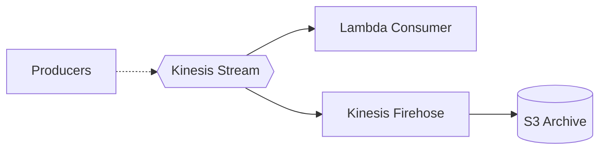

# Pattern: Stream Processing

## When to use
- Real-time event ingestion (clickstream, IoT telemetry, application logs)
- Need ordered, replayable event stream with multiple consumers
- Sub-second to low-single-digit second latency

## Not when
- Batch-style fan-out, minutes-latency acceptable → `event-driven-async`
- No real-time need → `data-lake` with batch ingestion
- Pub/sub with no ordering requirement → SNS + SQS (covered by `event-driven-async`)

## Components
- Kinesis Data Stream (on-demand mode by default; provisioned for `traffic = high`)
- Kinesis Firehose → S3 (archive path for replay + analytics)
- Lambda consumer (optional — direct stream processing)
- S3 archive bucket with Parquet conversion (Firehose data format conversion)
- CloudWatch Logs per consumer

## Parameters
| Interview input | Knob |
|---|---|
| `environments` | one stream per env |
| `region` | region-local |
| `traffic` | on-demand vs provisioned shards; Lambda parallelization factor |
| `data_sensitivity` | KMS CMK on stream + archive bucket; Firehose encryption |
| `auth` | n/a |

## Terraform layout
Flat.

## WAF pillar annotations
- **Reliability:** 24h retention default (up to 365d via `retention_period`); multiple consumers via enhanced fan-out.
- **Performance:** On-demand for variable traffic; parallelization factor tuned; Lambda batch size 100.
- **Cost:** On-demand billed per GB; Firehose buffering (128 MB or 300s) reduces S3 PUT cost.
- **Ops Excellence:** Alarms on iterator age, consumer errors, throttled records.
- **Sustainability:** Lambda Graviton; Firehose compresses + converts to Parquet.
- **Security:** CMK SSE on stream; IAM scoped to specific stream ARN.
- **Privacy:** Retention tunable per region policy; archive bucket region-local.

## Variations
- **Provisioned shards:** explicit shard count for cost predictability at scale
- **Kinesis Data Analytics:** SQL-over-stream — out of v1
- **Firehose → Redshift / OpenSearch:** out of v1

## Scope boundary
This pattern scopes to a single workload. The following controls are **account-scope** and handled by the `account-baseline` pattern (apply that first):
- CloudTrail (A.8.15) · GuardDuty (A.8.7) · Security Hub + standards (A.8.16) · AWS Config · IAM account password policy (A.8.5) · EBS encryption by default (A.8.24 account-level) · Access Analyzer · Inspector v2 · Macie.

Audit FAILs on these clauses against a workload module are expected — they're not gaps in this pattern.

## Mermaid snippet


## Terraform (complete)

### `versions.tf`
```hcl
terraform {
  required_version = ">= 1.7"
  required_providers { aws = { source = "hashicorp/aws", version = "~> 5.0" } }
}
```

### `variables.tf`
```hcl
variable "workload" {
  type = string
}
variable "environment" {
  type = string
}
variable "owner" {
  type = string
}
variable "cost_center" {
  type = string
}
variable "repository" {
  type = string
}
variable "region" {
  type = string
}
variable "data_sensitivity" {
  type = string
}
variable "stream_mode" {
  type        = string
  description = "ON_DEMAND | PROVISIONED"
}
variable "provisioned_shards" {
  type    = number
  default = 2
}
variable "retention_hours" {
  type    = number
  default = 24
}
variable "enable_lambda_consumer" {
  type    = bool
  default = true
}
```

### `main.tf`
```hcl
provider "aws" {
  region = var.region
  default_tags {
    tags = {
      Environment = var.environment
      Workload    = var.workload
      Owner       = var.owner
      CostCenter  = var.cost_center
      ManagedBy   = "terraform"
      Repository  = var.repository
    }
  }
}

locals {
  use_cmk = contains(["PII", "regulated-PII"], var.data_sensitivity)
}

resource "aws_kms_key" "stream" {
  count                   = local.use_cmk ? 1 : 0
  description             = "${var.workload}-${var.environment} stream CMK"
  deletion_window_in_days = 30
  enable_key_rotation     = true
}

resource "aws_kinesis_stream" "this" {
  name             = "${var.workload}-${var.environment}"
  retention_period = var.retention_hours
  shard_count      = var.stream_mode == "PROVISIONED" ? var.provisioned_shards : null
  stream_mode_details { stream_mode = var.stream_mode }
  encryption_type = "KMS"
  kms_key_id      = local.use_cmk ? aws_kms_key.stream[0].id : "alias/aws/kinesis"
}

resource "aws_s3_bucket" "archive" {
  bucket = "${var.workload}-${var.environment}-stream-archive"
}

resource "aws_s3_bucket_public_access_block" "archive" {
  bucket                  = aws_s3_bucket.archive.id
  block_public_acls       = true
  block_public_policy     = true
  ignore_public_acls      = true
  restrict_public_buckets = true
}

resource "aws_s3_bucket_server_side_encryption_configuration" "archive" {
  bucket = aws_s3_bucket.archive.id
  rule {
    apply_server_side_encryption_by_default {
      sse_algorithm     = local.use_cmk ? "aws:kms" : "AES256"
      kms_master_key_id = local.use_cmk ? aws_kms_key.stream[0].arn : null
    }
  }
}

resource "aws_s3_bucket_lifecycle_configuration" "archive" {
  bucket = aws_s3_bucket.archive.id
  rule {
    id     = "tier-archive"
    status = "Enabled"
    transition {
      days          = 30
      storage_class = "INTELLIGENT_TIERING"
    }
    transition {
      days          = 180
      storage_class = "GLACIER_IR"
    }
  }
}

resource "aws_iam_role" "firehose" {
  name = "${var.workload}-${var.environment}-firehose"
  assume_role_policy = jsonencode({
    Version   = "2012-10-17"
    Statement = [{ Action = "sts:AssumeRole", Effect = "Allow", Principal = { Service = "firehose.amazonaws.com" } }]
  })
}

resource "aws_iam_role_policy" "firehose" {
  role = aws_iam_role.firehose.id
  policy = jsonencode({
    Version = "2012-10-17"
    Statement = [
      { Effect = "Allow", Action = ["s3:AbortMultipartUpload", "s3:GetBucketLocation", "s3:GetObject", "s3:ListBucket", "s3:ListBucketMultipartUploads", "s3:PutObject"], Resource = [aws_s3_bucket.archive.arn, "${aws_s3_bucket.archive.arn}/*"] },
      { Effect = "Allow", Action = ["kinesis:DescribeStream", "kinesis:GetShardIterator", "kinesis:GetRecords", "kinesis:ListShards"], Resource = aws_kinesis_stream.this.arn },
      { Effect = "Allow", Action = ["logs:PutLogEvents"], Resource = "*" }
    ]
  })
}

resource "aws_cloudwatch_log_group" "firehose" {
  name              = "/aws/kinesisfirehose/${var.workload}-${var.environment}"
  retention_in_days = var.environment == "prod" ? 365 : 30
}

resource "aws_kinesis_firehose_delivery_stream" "archive" {
  name        = "${var.workload}-${var.environment}-archive"
  destination = "extended_s3"

  kinesis_source_configuration {
    kinesis_stream_arn = aws_kinesis_stream.this.arn
    role_arn           = aws_iam_role.firehose.arn
  }

  extended_s3_configuration {
    role_arn            = aws_iam_role.firehose.arn
    bucket_arn          = aws_s3_bucket.archive.arn
    buffering_size      = 128
    buffering_interval  = 300
    compression_format  = "UNCOMPRESSED" # set to GZIP if not using Parquet conversion
    prefix              = "year=!{timestamp:yyyy}/month=!{timestamp:MM}/day=!{timestamp:dd}/hour=!{timestamp:HH}/"
    error_output_prefix = "errors/"
    cloudwatch_logging_options {
      enabled         = true
      log_group_name  = aws_cloudwatch_log_group.firehose.name
      log_stream_name = "s3-delivery"
    }
  }
}

resource "aws_iam_role" "consumer" {
  count = var.enable_lambda_consumer ? 1 : 0
  name  = "${var.workload}-${var.environment}-consumer"
  assume_role_policy = jsonencode({
    Version   = "2012-10-17"
    Statement = [{ Action = "sts:AssumeRole", Effect = "Allow", Principal = { Service = "lambda.amazonaws.com" } }]
  })
}

resource "aws_iam_role_policy" "consumer" {
  count = var.enable_lambda_consumer ? 1 : 0
  role  = aws_iam_role.consumer[0].id
  policy = jsonencode({
    Version = "2012-10-17"
    Statement = [
      { Effect = "Allow", Action = ["logs:CreateLogStream", "logs:PutLogEvents"], Resource = "arn:aws:logs:${var.region}:*:log-group:/aws/lambda/*" },
      { Effect = "Allow", Action = ["kinesis:GetRecords", "kinesis:GetShardIterator", "kinesis:DescribeStream", "kinesis:ListShards"], Resource = aws_kinesis_stream.this.arn }
    ]
  })
}

data "archive_file" "consumer" {
  count       = var.enable_lambda_consumer ? 1 : 0
  type        = "zip"
  source_dir  = "${path.module}/lambdas/consumer"
  output_path = "${path.module}/build/consumer.zip"
}

resource "aws_lambda_function" "consumer" {
  count            = var.enable_lambda_consumer ? 1 : 0
  function_name    = "${var.workload}-${var.environment}-consumer"
  role             = aws_iam_role.consumer[0].arn
  handler          = "index.handler"
  runtime          = "python3.12"
  architectures    = ["arm64"]
  memory_size      = 512
  timeout          = 60
  filename         = data.archive_file.consumer[0].output_path
  source_code_hash = data.archive_file.consumer[0].output_base64sha256
}

resource "aws_lambda_event_source_mapping" "consumer" {
  count                              = var.enable_lambda_consumer ? 1 : 0
  event_source_arn                   = aws_kinesis_stream.this.arn
  function_name                      = aws_lambda_function.consumer[0].arn
  starting_position                  = "LATEST"
  batch_size                         = 100
  parallelization_factor             = var.stream_mode == "PROVISIONED" ? 2 : 1
  maximum_batching_window_in_seconds = 5
}
```

### `outputs.tf`
```hcl
output "stream_name" { value = aws_kinesis_stream.this.name }
output "archive_bucket" { value = aws_s3_bucket.archive.bucket }
```

### `terraform.tfvars.example`
```hcl
workload               = "acme-clickstream"
environment            = "prod"
owner                  = "data-team"
cost_center            = "2345"
repository             = "github.com/acme/clickstream"
region                 = "ap-southeast-1"
data_sensitivity       = "internal"
stream_mode            = "ON_DEMAND"
retention_hours        = 72
enable_lambda_consumer = true
```
