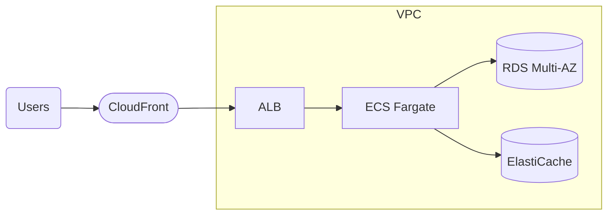

# Pattern: 3-Tier Containerized Web App

## When to use
- Web app with a relational database and steady HTTP traffic
- Existing container image the team wants to run without rewriting
- Stateful request handling (long-lived connections, server-side session state)

## Not when
- Sporadic traffic with long idle periods → `serverless-rest-api`
- No database at all → `static-site-cdn`
- Event-driven workflow → `event-driven-async`

## Components
- `vpc-foundation` (composed)
- ALB (public, HTTPS, ACM cert)
- ECS Fargate service, 2+ tasks across 2 AZs
- RDS Postgres Multi-AZ (primary) with read replica when `traffic = high` (optional variation)
- ElastiCache Redis (optional — enabled when `traffic ∈ {medium, high}`)
- Secrets Manager for DB credentials
- ECR repo for container images
- CloudWatch Logs + Container Insights

## Parameters
| Interview input | Knob |
|---|---|
| `environments` | ECS cluster per env; RDS instance class; Multi-AZ on/off |
| `region` | provider + VPC region |
| `traffic` | Fargate task count + CPU/memory; RDS instance class; ElastiCache on/off |
| `data_sensitivity` | RDS/S3 CMK when ≥PII; VPC flow logs forced on |
| `auth` | `Cognito` → ALB listener rule with `authenticate-cognito` action |

## Terraform layout
Modular (this is a complex pattern):
```
modules/
├── networking/   ← copied from vpc-foundation
├── compute/      ← ALB, ECS cluster, service, task def, ECR
└── data/         ← RDS, ElastiCache, Secrets Manager
main.tf           ← wires modules together
variables.tf, outputs.tf, versions.tf, terraform.tfvars.example
```

## WAF pillar annotations
- **Reliability:** Multi-AZ Fargate + RDS; automated backups 7d non-prod, 30d prod; ECS service autoscaling on CPU.
- **Performance:** Graviton Fargate (ARM64); RDS r6g class; ElastiCache r6g; ALB cross-zone LB ON.
- **Cost:** Fargate Spot for non-prod; NAT single in dev; RDS gp3 storage; ElastiCache only when traffic justifies.
- **Ops Excellence:** Container Insights on; log retention 30/365d; alarms on ALB 5xx, ECS CPU, RDS CPU, RDS free storage.
- **Sustainability:** Graviton everywhere; single NAT dev; dev scheduled-stop tags (user wires scheduler).
- **Security:** IMDSv2 enforced where applicable; RDS encrypted (CMK when PII+); SGs chain ALB→ECS→RDS; no public RDS.
- **Privacy:** Deletion protection on prod RDS; VPC flow logs when PII+; region-local.

## Variations
- **+ async queue:** compose with `event-driven-async` — add SQS + consumer ECS task or Lambda
- **+ read replica:** enable `rds_read_replica = true` for `traffic = high`
- **+ Cognito:** add `aws_lb_listener_rule` with `authenticate-cognito` action

## Scope boundary
This pattern scopes to a single workload. The following controls are **account-scope** and handled by the `account-baseline` pattern (apply that first):
- CloudTrail (A.8.15) · GuardDuty (A.8.7) · Security Hub + standards (A.8.16) · AWS Config · IAM account password policy (A.8.5) · EBS encryption by default (A.8.24 account-level) · Access Analyzer · Inspector v2 · Macie.

Audit FAILs on these clauses against a workload module are expected — they're not gaps in this pattern.

## Mermaid snippet


## Terraform (complete)

### `versions.tf`
```hcl
terraform {
  required_version = ">= 1.7"
  required_providers {
    aws = { source = "hashicorp/aws", version = "~> 5.0" }
  }
}
```

### `variables.tf`
```hcl
variable "workload" { type = string }
variable "environment" { type = string }
variable "owner" { type = string }
variable "cost_center" { type = string }
variable "repository" { type = string }
variable "region" { type = string }
variable "az_count" { type = number }
variable "single_nat" { type = bool }
variable "fargate_desired_count" { type = number }
variable "fargate_cpu" {
  type        = number
  description = "256/512/1024"
}
variable "fargate_memory" {
  type        = number
  description = "512/1024/2048"
}
variable "fargate_spot" {
  type    = bool
  default = false
}
variable "rds_instance_class" { type = string }
variable "rds_multi_az" { type = bool }
variable "rds_backup_retention" { type = number }
variable "enable_cache" { type = bool }
variable "cache_node_type" {
  type    = string
  default = "cache.t4g.micro"
}
variable "container_image" {
  type        = string
  description = "ECR image URI or placeholder — user replaces post-first-apply"
}
variable "container_port" {
  type    = number
  default = 8080
}
variable "data_sensitivity" { type = string }
variable "domain_name" {
  type    = string
  default = null
}
variable "acm_certificate_arn" {
  type    = string
  default = null
}
```

### `main.tf`
```hcl
provider "aws" {
  region = var.region
  default_tags {
    tags = {
      Environment = var.environment
      Workload    = var.workload
      Owner       = var.owner
      CostCenter  = var.cost_center
      ManagedBy   = "terraform"
      Repository  = var.repository
    }
  }
}

module "networking" {
  source               = "./modules/networking"
  workload             = var.workload
  environment          = var.environment
  region               = var.region
  az_count             = var.az_count
  single_nat           = var.single_nat
  enable_flow_logs     = contains(["PII", "regulated-PII"], var.data_sensitivity)
  enable_ecs_endpoints = true
}

module "compute" {
  source                = "./modules/compute"
  workload              = var.workload
  environment           = var.environment
  vpc_id                = module.networking.vpc_id
  public_subnet_ids     = module.networking.public_subnet_ids
  private_subnet_ids    = module.networking.private_subnet_ids
  fargate_desired_count = var.fargate_desired_count
  fargate_cpu           = var.fargate_cpu
  fargate_memory        = var.fargate_memory
  fargate_spot          = var.fargate_spot
  container_image       = var.container_image
  container_port        = var.container_port
  acm_certificate_arn   = var.acm_certificate_arn
  db_secret_arn         = module.data.db_secret_arn
  db_endpoint           = module.data.db_endpoint
  cache_endpoint        = var.enable_cache ? module.data.cache_endpoint : ""
}

module "data" {
  source                = "./modules/data"
  workload              = var.workload
  environment           = var.environment
  isolated_subnet_ids   = module.networking.isolated_subnet_ids
  vpc_id                = module.networking.vpc_id
  vpc_cidr              = "10.0.0.0/16" # matches networking module default
  rds_instance_class    = var.rds_instance_class
  rds_multi_az          = var.rds_multi_az
  rds_backup_retention  = var.rds_backup_retention
  enable_cache          = var.enable_cache
  cache_node_type       = var.cache_node_type
  data_sensitivity      = var.data_sensitivity
  app_security_group_id = module.compute.task_security_group_id
}
```

### `modules/compute/main.tf`

```hcl
variable "workload" { type = string }
variable "environment" { type = string }
variable "vpc_id" { type = string }
variable "public_subnet_ids" { type = list(string) }
variable "private_subnet_ids" { type = list(string) }
variable "fargate_desired_count" { type = number }
variable "fargate_cpu" { type = number }
variable "fargate_memory" { type = number }
variable "fargate_spot" { type = bool }
variable "container_image" { type = string }
variable "container_port" { type = number }
variable "acm_certificate_arn" { type = string }
variable "db_secret_arn" { type = string }
variable "db_endpoint" { type = string }
variable "cache_endpoint" { type = string }

resource "aws_security_group" "alb" {
  name   = "${var.workload}-${var.environment}-alb"
  vpc_id = var.vpc_id
  ingress {
    from_port   = 443
    to_port     = 443
    protocol    = "tcp"
    cidr_blocks = ["0.0.0.0/0"]
  }
  ingress {
    from_port   = 80
    to_port     = 80
    protocol    = "tcp"
    cidr_blocks = ["0.0.0.0/0"]
  }
  egress {
    from_port   = 0
    to_port     = 0
    protocol    = "-1"
    cidr_blocks = ["0.0.0.0/0"]
  }
}

resource "aws_security_group" "task" {
  name   = "${var.workload}-${var.environment}-task"
  vpc_id = var.vpc_id
  ingress {
    from_port       = var.container_port
    to_port         = var.container_port
    protocol        = "tcp"
    security_groups = [aws_security_group.alb.id]
  }
  egress {
    from_port   = 0
    to_port     = 0
    protocol    = "-1"
    cidr_blocks = ["0.0.0.0/0"]
  }
}

resource "aws_lb" "this" {
  name                       = "${var.workload}-${var.environment}"
  internal                   = false
  load_balancer_type         = "application"
  security_groups            = [aws_security_group.alb.id]
  subnets                    = var.public_subnet_ids
  enable_deletion_protection = var.environment == "prod"
  drop_invalid_header_fields = true
}

resource "aws_lb_target_group" "tg" {
  name        = "${var.workload}-${var.environment}"
  port        = var.container_port
  protocol    = "HTTP"
  vpc_id      = var.vpc_id
  target_type = "ip"
  health_check {
    path                = "/health"
    healthy_threshold   = 2
    unhealthy_threshold = 3
    interval            = 30
    matcher             = "200"
  }
}

resource "aws_lb_listener" "http" {
  load_balancer_arn = aws_lb.this.arn
  port              = 80
  protocol          = "HTTP"
  default_action {
    type = "redirect"
    redirect {
      port        = "443"
      protocol    = "HTTPS"
      status_code = "HTTP_301"
    }
  }
}

resource "aws_lb_listener" "https" {
  load_balancer_arn = aws_lb.this.arn
  port              = 443
  protocol          = "HTTPS"
  ssl_policy        = "ELBSecurityPolicy-TLS13-1-2-2021-06"
  certificate_arn   = var.acm_certificate_arn
  default_action {
    type             = "forward"
    target_group_arn = aws_lb_target_group.tg.arn
  }
}

resource "aws_ecs_cluster" "this" {
  name = "${var.workload}-${var.environment}"
  setting {
    name  = "containerInsights"
    value = "enabled"
  }
}

resource "aws_iam_role" "task_execution" {
  name = "${var.workload}-${var.environment}-task-exec"
  assume_role_policy = jsonencode({
    Version = "2012-10-17"
    Statement = [{
      Action    = "sts:AssumeRole"
      Effect    = "Allow"
      Principal = { Service = "ecs-tasks.amazonaws.com" }
    }]
  })
}

resource "aws_iam_role_policy_attachment" "task_execution" {
  role       = aws_iam_role.task_execution.name
  policy_arn = "arn:aws:iam::aws:policy/service-role/AmazonECSTaskExecutionRolePolicy"
}

resource "aws_iam_role_policy" "task_execution_secrets" {
  role = aws_iam_role.task_execution.id
  policy = jsonencode({
    Version = "2012-10-17"
    Statement = [{
      Effect   = "Allow"
      Action   = ["secretsmanager:GetSecretValue"]
      Resource = var.db_secret_arn
    }]
  })
}

resource "aws_iam_role" "task" {
  name = "${var.workload}-${var.environment}-task"
  assume_role_policy = jsonencode({
    Version = "2012-10-17"
    Statement = [{
      Action    = "sts:AssumeRole"
      Effect    = "Allow"
      Principal = { Service = "ecs-tasks.amazonaws.com" }
    }]
  })
}

resource "aws_cloudwatch_log_group" "app" {
  name              = "/ecs/${var.workload}-${var.environment}"
  retention_in_days = var.environment == "prod" ? 365 : 30
}

resource "aws_ecs_task_definition" "this" {
  family                   = "${var.workload}-${var.environment}"
  requires_compatibilities = ["FARGATE"]
  network_mode             = "awsvpc"
  cpu                      = var.fargate_cpu
  memory                   = var.fargate_memory
  runtime_platform {
    cpu_architecture        = "ARM64"
    operating_system_family = "LINUX"
  }
  execution_role_arn = aws_iam_role.task_execution.arn
  task_role_arn      = aws_iam_role.task.arn
  container_definitions = jsonencode([{
    name         = "app"
    image        = var.container_image
    essential    = true
    portMappings = [{ containerPort = var.container_port }]
    secrets      = [{ name = "DATABASE_URL", valueFrom = var.db_secret_arn }]
    environment = [
      { name = "DB_ENDPOINT", value = var.db_endpoint },
      { name = "CACHE_ENDPOINT", value = var.cache_endpoint }
    ]
    logConfiguration = {
      logDriver = "awslogs"
      options = {
        "awslogs-group"         = aws_cloudwatch_log_group.app.name
        "awslogs-region"        = data.aws_region.current.name
        "awslogs-stream-prefix" = "app"
      }
    }
  }])
}

data "aws_region" "current" {}

resource "aws_ecs_service" "this" {
  name            = "${var.workload}-${var.environment}"
  cluster         = aws_ecs_cluster.this.id
  task_definition = aws_ecs_task_definition.this.arn
  desired_count   = var.fargate_desired_count
  launch_type     = var.fargate_spot ? null : "FARGATE"

  dynamic "capacity_provider_strategy" {
    for_each = var.fargate_spot ? [1] : []
    content {
      capacity_provider = "FARGATE_SPOT"
      weight            = 1
    }
  }

  network_configuration {
    subnets          = var.private_subnet_ids
    security_groups  = [aws_security_group.task.id]
    assign_public_ip = false
  }

  load_balancer {
    target_group_arn = aws_lb_target_group.tg.arn
    container_name   = "app"
    container_port   = var.container_port
  }

  deployment_circuit_breaker {
    enable   = true
    rollback = true
  }
}

resource "aws_appautoscaling_target" "ecs" {
  max_capacity       = var.fargate_desired_count * 4
  min_capacity       = var.fargate_desired_count
  resource_id        = "service/${aws_ecs_cluster.this.name}/${aws_ecs_service.this.name}"
  scalable_dimension = "ecs:service:DesiredCount"
  service_namespace  = "ecs"
}

resource "aws_appautoscaling_policy" "cpu" {
  name               = "${var.workload}-${var.environment}-cpu"
  policy_type        = "TargetTrackingScaling"
  resource_id        = aws_appautoscaling_target.ecs.resource_id
  scalable_dimension = aws_appautoscaling_target.ecs.scalable_dimension
  service_namespace  = aws_appautoscaling_target.ecs.service_namespace
  target_tracking_scaling_policy_configuration {
    predefined_metric_specification {
      predefined_metric_type = "ECSServiceAverageCPUUtilization"
    }
    target_value = 60
  }
}

output "task_security_group_id" { value = aws_security_group.task.id }
output "alb_dns_name" { value = aws_lb.this.dns_name }
```

### `modules/data/main.tf`

```hcl
variable "workload" { type = string }
variable "environment" { type = string }
variable "isolated_subnet_ids" { type = list(string) }
variable "vpc_id" { type = string }
variable "vpc_cidr" { type = string }
variable "rds_instance_class" { type = string }
variable "rds_multi_az" { type = bool }
variable "rds_backup_retention" { type = number }
variable "enable_cache" { type = bool }
variable "cache_node_type" { type = string }
variable "data_sensitivity" { type = string }
variable "app_security_group_id" { type = string }

locals {
  use_cmk = contains(["PII", "regulated-PII"], var.data_sensitivity)
}

resource "aws_kms_key" "rds" {
  count                   = local.use_cmk ? 1 : 0
  description             = "${var.workload}-${var.environment} RDS CMK"
  deletion_window_in_days = 30
  enable_key_rotation     = true
}

resource "aws_db_subnet_group" "this" {
  name       = "${var.workload}-${var.environment}"
  subnet_ids = var.isolated_subnet_ids
}

resource "aws_security_group" "rds" {
  name   = "${var.workload}-${var.environment}-rds"
  vpc_id = var.vpc_id
  ingress {
    from_port       = 5432
    to_port         = 5432
    protocol        = "tcp"
    security_groups = [var.app_security_group_id]
  }
}

resource "random_password" "db" {
  length           = 24
  special          = true
  override_special = "!#$%&*+-=?"
}

resource "aws_secretsmanager_secret" "db" {
  name                    = "${var.workload}-${var.environment}/db"
  recovery_window_in_days = 0
  kms_key_id              = local.use_cmk ? aws_kms_key.rds[0].id : null
}

resource "aws_secretsmanager_secret_version" "db" {
  secret_id = aws_secretsmanager_secret.db.id
  secret_string = jsonencode({
    username = "appuser"
    password = random_password.db.result
  })
}

resource "aws_db_instance" "this" {
  identifier                      = "${var.workload}-${var.environment}"
  engine                          = "postgres"
  engine_version                  = "16"
  instance_class                  = var.rds_instance_class
  allocated_storage               = 20
  max_allocated_storage           = 500
  storage_type                    = "gp3"
  storage_encrypted               = true
  kms_key_id                      = local.use_cmk ? aws_kms_key.rds[0].arn : null
  db_subnet_group_name            = aws_db_subnet_group.this.name
  vpc_security_group_ids          = [aws_security_group.rds.id]
  multi_az                        = var.rds_multi_az
  backup_retention_period         = var.rds_backup_retention
  deletion_protection             = var.environment == "prod"
  skip_final_snapshot             = var.environment != "prod"
  username                        = "appuser"
  password                        = random_password.db.result
  performance_insights_enabled    = true
  enabled_cloudwatch_logs_exports = ["postgresql", "upgrade"]
}

resource "aws_elasticache_subnet_group" "this" {
  count      = var.enable_cache ? 1 : 0
  name       = "${var.workload}-${var.environment}-cache"
  subnet_ids = var.isolated_subnet_ids
}

resource "aws_security_group" "cache" {
  count  = var.enable_cache ? 1 : 0
  name   = "${var.workload}-${var.environment}-cache"
  vpc_id = var.vpc_id
  ingress {
    from_port       = 6379
    to_port         = 6379
    protocol        = "tcp"
    security_groups = [var.app_security_group_id]
  }
}

resource "aws_elasticache_replication_group" "this" {
  count                      = var.enable_cache ? 1 : 0
  replication_group_id       = "${var.workload}-${var.environment}"
  description                = "${var.workload} cache"
  engine                     = "redis"
  node_type                  = var.cache_node_type
  num_cache_clusters         = 2
  automatic_failover_enabled = true
  multi_az_enabled           = true
  subnet_group_name          = aws_elasticache_subnet_group.this[0].name
  security_group_ids         = [aws_security_group.cache[0].id]
  at_rest_encryption_enabled = true
  transit_encryption_enabled = true
}

output "db_secret_arn" { value = aws_secretsmanager_secret.db.arn }
output "db_endpoint" { value = aws_db_instance.this.endpoint }
output "cache_endpoint" { value = var.enable_cache ? aws_elasticache_replication_group.this[0].primary_endpoint_address : "" }
```

### `outputs.tf`
```hcl
output "alb_dns_name" { value = module.compute.alb_dns_name }
output "db_endpoint" {
  value     = module.data.db_endpoint
  sensitive = true
}
```

### `terraform.tfvars.example`
```hcl
workload             = "acme-shop"
environment          = "prod"
owner                = "shop-team"
cost_center          = "9876"
repository           = "github.com/acme/shop"
region               = "ap-southeast-1"
az_count             = 3
single_nat           = false
fargate_desired_count= 3
fargate_cpu          = 512
fargate_memory       = 1024
fargate_spot         = false
rds_instance_class   = "db.r6g.large"
rds_multi_az         = true
rds_backup_retention = 30
enable_cache         = true
cache_node_type      = "cache.r6g.large"
container_image      = "123456789012.dkr.ecr.ap-southeast-1.amazonaws.com/acme-shop:latest"
container_port       = 8080
data_sensitivity     = "PII"
acm_certificate_arn  = "arn:aws:acm:ap-southeast-1:123456789012:certificate/..."
```

**Note to generator subagent:** the `modules/networking/` module is imported wholesale from `vpc-foundation.md`. When composing, copy the complete networking files from that pattern, don't duplicate them in this pattern's content.
