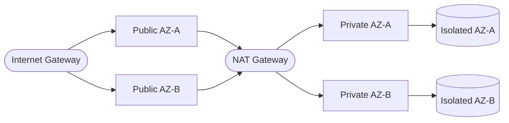

# Pattern: VPC Foundation

## When to use
- Required foundation for any pattern that places resources in a VPC (RDS, ECS, EC2, VPC-bound Lambda, ElastiCache, OpenSearch)
- Generated either as the primary pattern (standalone networking project) or composed silently by any pattern whose annotation lists `vpc-foundation` as a dependency

## Not when
- Pure-serverless pattern with no VPC resources (`static-site-cdn`, `serverless-rest-api` without VPC Lambda, `scheduled-jobs` running as vanilla Lambda)
- User already has a shared VPC and the generated code should consume it via data sources (out of v1 scope — document as manual post-generation step)

## Components
- 1 VPC (CIDR `10.0.0.0/16` default, configurable)
- 2 or 3 AZs (derived from region; prod gets 3, non-prod gets 2)
- Public subnets (one per AZ) for ALB / NAT Gateway
- Private subnets (one per AZ) for compute (ECS tasks, Lambda ENIs)
- Isolated subnets (one per AZ) for data (RDS, ElastiCache)
- Internet Gateway
- NAT Gateway — per-AZ for prod, single for non-prod (Sustainability + Reliability trade-off documented in pattern)
- VPC Flow Logs → CloudWatch (30d retention non-prod, 365d prod)
- VPC endpoints: S3 (Gateway), DynamoDB (Gateway), plus `ecr.api`, `ecr.dkr`, `logs`, `secretsmanager` (Interface) when pattern uses ECS
- Default security group: no inbound, no outbound (forces explicit SGs)

## Parameters (from interview)
| Interview input | VPC foundation knob |
|---|---|
| `environments` | AZ count (prod=3, non-prod=2), NAT Gateway count (prod=per-AZ, non-prod=single) |
| `region` | `provider` block + `data.aws_availability_zones.available` |
| `traffic` | unused here (compute sizing is pattern-level) |
| `data_sensitivity ≥ PII` | enables VPC Flow Logs (normally optional for non-PII, required for PII+) |
| `auth` | unused here |

## Terraform layout
```
modules/networking/
├── main.tf         ← VPC, subnets, IGW, NAT, route tables
├── endpoints.tf    ← VPC endpoints
├── flow-logs.tf    ← flow log, log group, IAM role
├── variables.tf
├── outputs.tf      ← vpc_id, subnet IDs by tier, security group defaults
```

When generated standalone, these files sit at the root with no `modules/` wrapper.

## WAF pillar annotations
- **Reliability:** 2 AZs minimum, 3 AZs for prod. NAT Gateway: per-AZ in prod (no single-point-of-failure); single in non-prod (documented).
- **Performance:** VPC endpoints for S3/DynamoDB reduce latency + cost; Gateway endpoints are free. Interface endpoints for ECR/Logs/Secrets when ECS used.
- **Cost:** Single NAT in dev saves ~$64/mo × (AZs-1); VPC endpoints reduce NAT data processing cost. No EIP charges beyond NAT.
- **Ops Excellence:** All subnets tagged with tier (`Tier = public|private|isolated`); default SG locked down; VPC Flow Logs → CloudWatch.
- **Sustainability:** VPC endpoints reduce NAT traffic (lower carbon); single NAT in dev; Graviton not applicable here.
- **Security:** Default SG denies all; Flow Logs for PII+ data sensitivity; NACLs left at default (pattern relies on SGs).
- **Privacy:** Flow Logs enabled for `data_sensitivity ≥ PII`; all subnets within the user-specified region (no cross-region primitives).

## Variations
- **Single-AZ dev:** AZ count = 1 when `environments = ["dev"]` and user explicitly opts in (annotate the trade-off in ADR Consequences)
- **No NAT (endpoints only):** dev-only; requires every required AWS API to have a VPC endpoint. Skip in v1 unless user explicitly requests.

## Scope boundary
This pattern scopes to a single workload. The following controls are **account-scope** and handled by the `account-baseline` pattern (apply that first):
- CloudTrail (A.8.15) · GuardDuty (A.8.7) · Security Hub + standards (A.8.16) · AWS Config · IAM account password policy (A.8.5) · EBS encryption by default (A.8.24 account-level) · Access Analyzer · Inspector v2 · Macie.

Audit FAILs on these clauses against a workload module are expected — they're not gaps in this pattern.

## Mermaid snippet


## Terraform (complete)

### `modules/networking/variables.tf`
```hcl
variable "workload"    { type = string }
variable "environment" { type = string }
variable "region"      { type = string }

variable "vpc_cidr" {
  type    = string
  default = "10.0.0.0/16"
}

variable "az_count" {
  type        = number
  description = "2 for non-prod, 3 for prod"
}

variable "single_nat" {
  type        = bool
  description = "true for non-prod, false for prod"
}

variable "enable_flow_logs" {
  type    = bool
  default = true
}

variable "enable_ecs_endpoints" {
  type    = bool
  default = false
}
```

### `modules/networking/main.tf`
```hcl
data "aws_availability_zones" "available" {
  state = "available"
}

locals {
  azs = slice(data.aws_availability_zones.available.names, 0, var.az_count)
  public_subnets   = [for i, az in local.azs : cidrsubnet(var.vpc_cidr, 8, i)]
  private_subnets  = [for i, az in local.azs : cidrsubnet(var.vpc_cidr, 8, i + 10)]
  isolated_subnets = [for i, az in local.azs : cidrsubnet(var.vpc_cidr, 8, i + 20)]
}

resource "aws_vpc" "this" {
  cidr_block           = var.vpc_cidr
  enable_dns_support   = true
  enable_dns_hostnames = true
  tags = { Name = "${var.workload}-${var.environment}" }
}

resource "aws_internet_gateway" "this" {
  vpc_id = aws_vpc.this.id
  tags   = { Name = "${var.workload}-${var.environment}-igw" }
}

resource "aws_subnet" "public" {
  for_each                = { for i, az in local.azs : az => i }
  vpc_id                  = aws_vpc.this.id
  cidr_block              = local.public_subnets[each.value]
  availability_zone       = each.key
  map_public_ip_on_launch = false
  tags = {
    Name = "${var.workload}-${var.environment}-public-${each.key}"
    Tier = "public"
  }
}

resource "aws_subnet" "private" {
  for_each          = { for i, az in local.azs : az => i }
  vpc_id            = aws_vpc.this.id
  cidr_block        = local.private_subnets[each.value]
  availability_zone = each.key
  tags = {
    Name = "${var.workload}-${var.environment}-private-${each.key}"
    Tier = "private"
  }
}

resource "aws_subnet" "isolated" {
  for_each          = { for i, az in local.azs : az => i }
  vpc_id            = aws_vpc.this.id
  cidr_block        = local.isolated_subnets[each.value]
  availability_zone = each.key
  tags = {
    Name = "${var.workload}-${var.environment}-isolated-${each.key}"
    Tier = "isolated"
  }
}

resource "aws_eip" "nat" {
  for_each = var.single_nat ? toset([local.azs[0]]) : toset(local.azs)
  domain   = "vpc"
  tags     = { Name = "${var.workload}-${var.environment}-nat-${each.key}" }
}

resource "aws_nat_gateway" "this" {
  for_each      = var.single_nat ? toset([local.azs[0]]) : toset(local.azs)
  allocation_id = aws_eip.nat[each.key].id
  subnet_id     = aws_subnet.public[each.key].id
  tags          = { Name = "${var.workload}-${var.environment}-nat-${each.key}" }
  depends_on    = [aws_internet_gateway.this]
}

resource "aws_route_table" "public" {
  vpc_id = aws_vpc.this.id
  route {
    cidr_block = "0.0.0.0/0"
    gateway_id = aws_internet_gateway.this.id
  }
  tags = { Name = "${var.workload}-${var.environment}-public" }
}

resource "aws_route_table_association" "public" {
  for_each       = aws_subnet.public
  subnet_id      = each.value.id
  route_table_id = aws_route_table.public.id
}

resource "aws_route_table" "private" {
  for_each = aws_subnet.private
  vpc_id   = aws_vpc.this.id
  route {
    cidr_block     = "0.0.0.0/0"
    nat_gateway_id = var.single_nat ? aws_nat_gateway.this[local.azs[0]].id : aws_nat_gateway.this[each.key].id
  }
  tags = { Name = "${var.workload}-${var.environment}-private-${each.key}" }
}

resource "aws_route_table_association" "private" {
  for_each       = aws_subnet.private
  subnet_id      = each.value.id
  route_table_id = aws_route_table.private[each.key].id
}

resource "aws_route_table" "isolated" {
  vpc_id = aws_vpc.this.id
  tags   = { Name = "${var.workload}-${var.environment}-isolated" }
}

resource "aws_route_table_association" "isolated" {
  for_each       = aws_subnet.isolated
  subnet_id      = each.value.id
  route_table_id = aws_route_table.isolated.id
}

resource "aws_default_security_group" "this" {
  vpc_id = aws_vpc.this.id
  tags   = { Name = "${var.workload}-${var.environment}-default-deny" }
  # no ingress, no egress — locks down default SG
}
```

### `modules/networking/endpoints.tf`
```hcl
resource "aws_vpc_endpoint" "s3" {
  vpc_id            = aws_vpc.this.id
  service_name      = "com.amazonaws.${var.region}.s3"
  vpc_endpoint_type = "Gateway"
  route_table_ids   = concat([for rt in aws_route_table.private : rt.id], [aws_route_table.isolated.id])
}

resource "aws_vpc_endpoint" "dynamodb" {
  vpc_id            = aws_vpc.this.id
  service_name      = "com.amazonaws.${var.region}.dynamodb"
  vpc_endpoint_type = "Gateway"
  route_table_ids   = concat([for rt in aws_route_table.private : rt.id], [aws_route_table.isolated.id])
}

resource "aws_security_group" "interface_endpoints" {
  count       = var.enable_ecs_endpoints ? 1 : 0
  name        = "${var.workload}-${var.environment}-vpce"
  description = "HTTPS from VPC for interface endpoints"
  vpc_id      = aws_vpc.this.id
  ingress {
    from_port   = 443
    to_port     = 443
    protocol    = "tcp"
    cidr_blocks = [var.vpc_cidr]
  }
  egress {
    from_port   = 0
    to_port     = 0
    protocol    = "-1"
    cidr_blocks = ["0.0.0.0/0"]
  }
}

locals {
  interface_services = var.enable_ecs_endpoints ? [
    "ecr.api", "ecr.dkr", "logs", "secretsmanager"
  ] : []
}

resource "aws_vpc_endpoint" "interface" {
  for_each            = toset(local.interface_services)
  vpc_id              = aws_vpc.this.id
  service_name        = "com.amazonaws.${var.region}.${each.key}"
  vpc_endpoint_type   = "Interface"
  subnet_ids          = [for s in aws_subnet.private : s.id]
  security_group_ids  = [aws_security_group.interface_endpoints[0].id]
  private_dns_enabled = true
}
```

### `modules/networking/flow-logs.tf`
```hcl
resource "aws_cloudwatch_log_group" "flow_logs" {
  count             = var.enable_flow_logs ? 1 : 0
  name              = "/aws/vpc/${var.workload}-${var.environment}/flow-logs"
  retention_in_days = var.environment == "prod" ? 365 : 30
}

resource "aws_iam_role" "flow_logs" {
  count = var.enable_flow_logs ? 1 : 0
  name  = "${var.workload}-${var.environment}-vpc-flow-logs"
  assume_role_policy = jsonencode({
    Version = "2012-10-17"
    Statement = [{
      Action    = "sts:AssumeRole"
      Effect    = "Allow"
      Principal = { Service = "vpc-flow-logs.amazonaws.com" }
    }]
  })
}

resource "aws_iam_role_policy" "flow_logs" {
  count = var.enable_flow_logs ? 1 : 0
  role  = aws_iam_role.flow_logs[0].id
  policy = jsonencode({
    Version = "2012-10-17"
    Statement = [{
      Action = [
        "logs:CreateLogStream",
        "logs:PutLogEvents",
        "logs:DescribeLogStreams"
      ]
      Effect   = "Allow"
      Resource = "${aws_cloudwatch_log_group.flow_logs[0].arn}:*"
    }]
  })
}

resource "aws_flow_log" "this" {
  count                = var.enable_flow_logs ? 1 : 0
  iam_role_arn         = aws_iam_role.flow_logs[0].arn
  log_destination      = aws_cloudwatch_log_group.flow_logs[0].arn
  traffic_type         = "ALL"
  vpc_id               = aws_vpc.this.id
  max_aggregation_interval = 60
}
```

### `modules/networking/outputs.tf`
```hcl
output "vpc_id"             { value = aws_vpc.this.id }
output "public_subnet_ids"  { value = [for s in aws_subnet.public   : s.id] }
output "private_subnet_ids" { value = [for s in aws_subnet.private  : s.id] }
output "isolated_subnet_ids"{ value = [for s in aws_subnet.isolated : s.id] }
output "default_sg_id"      { value = aws_default_security_group.this.id }
```
