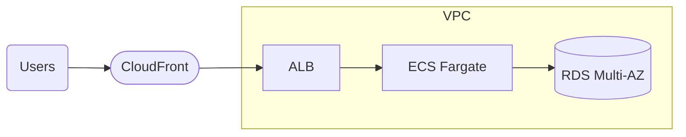

# Mermaid Diagram Conventions (cloud-architect)

All architecture diagrams in generated ADRs use `flowchart LR` (left-to-right) and follow the node and edge rules below. The generation subagent MUST apply these to whatever Mermaid snippet it takes from a pattern file.

---

## Orientation

Always `flowchart LR`. Never `TD`, `RL`, or `BT`. Users scan diagrams horizontally in the ADR.

## Node shape conventions

| AWS resource category | Mermaid node shape | Example |
|---|---|---|
| Users / external actors | rounded rectangle `(...)` | `U(Users)` |
| Compute (ECS, Lambda, EC2, Batch) | rectangle `[...]` | `L[Lambda]` |
| Storage (S3, EFS, EBS, RDS, DynamoDB) | cylinder `[(...)]` | `DB[(RDS Multi-AZ)]` |
| Edge / CDN / DNS (CloudFront, Route53) | stadium `([...])` | `CF([CloudFront])` |
| Messaging / streaming (SQS, SNS, EventBridge, Kinesis) | hexagon `{{...}}` | `Q{{SQS}}` |
| Security / auth (Cognito, IAM boundary) | subroutine `[[...]]` | `AUTH[[Cognito]]` |
| Managed networking (ALB, NLB, API Gateway) | rectangle `[...]` with bold label | `ALB[ALB]` |

## Edge conventions

- User-facing request path: solid arrow `-->`
- Async / event flow: dashed arrow `-.->`
- Data replication / backup: thick arrow `==>`

## Grouping

Use `subgraph` ONLY when the pattern spans public + private boundaries or crosses accounts. Example:

Do not use `subgraph` to visually group unrelated resources — it adds noise.

## Label conventions

- Resource labels are the AWS service name plus a critical modifier only (e.g., `RDS Multi-AZ`, not `RDS Multi-AZ Postgres 16 db.r6g.large`).
- Avoid Terraform resource names in labels.
- Keep each label ≤ 25 characters.

## What NOT to include

- IAM roles or policies — those live in the Terraform and audit findings, not the diagram
- Route tables, NACLs, security group rules — too low-level for an architecture diagram
- CloudWatch / logging nodes — assumed present for every compute resource; redundant in the diagram
- VPC endpoints — unless the VPC has no NAT Gateway and endpoints are the point being illustrated

## Validation

Every generated Mermaid snippet must:
1. Start with `flowchart LR`
2. Have fewer than 15 nodes (reduce if composed patterns would exceed this)
3. Pass visual check — no dangling edges, no orphan nodes
